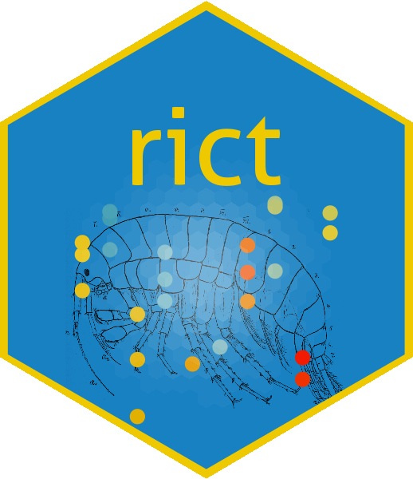

<!-- README.md is generated from README.Rmd. Please edit that file -->

# rict 

[](https://travis-ci.org/aquaMetrics/rict)
[](https://ci.appveyor.com/project/ecodata1/rict/branch/master)
[](https://codecov.io/gh/aquaMetrics/rict?branch=master)

## Overview

An R package for calculating River Invertebrate Classification Tool (RICT) predictions

# Work in progress

This R package is in development. Please don't use in production. Please use
the [RICT
website](https://www.fba.org.uk/FBA/Discover-and-Learn/Projects/RIVPACS-RICT/Public/Discover-and-Learn/Projects/RIVPACS-RICT-Landing-Page.aspx?hkey=72b27a8b-d566-4bab-b863-ca39545226ae)
for official documentation and links to the Azure experiments.

## Install

Install [R](rstats.org/install) and we also recommend installing [Rstudio](rstudio.com/install).

Alternatively, use [R Cloud](https://rstudio.cloud) through your browser.

In the R console, install the development version from GitHub:
```
install.packages("devtools")
library(devtools)
install_github("aquaMetrics/rict")
library(rict)
```

Open interactive web app:

```
rict_app()
```
Or run the demo dataset through the `rict` function in R to get classification results:

```
results <- rict(demo_observed_values)
```
Use `rict_predict` to only calculate predictions:

```
predictions <- rict_predict(demo_observed_values)
```
And `rict_classify` to classify these predictions:

```
results <- rict_classify(predictions)
```
See [documentation](https://aquametrics.github.io/rict/) for further usage details. For example, how to change the default `year_type` from multi-year to single year classification:

```
results <- rict(demo_gis_values_log, year_type = "single")
```
## Contributing 

Please read the [Contributing Guidelines](CONTRIBUTING.md) file for more details. 

## Code of Conduct

Please note that this project is released with a [Contributor Code of Conduct](CONDUCT.md). By participating in this project you agree to abide by its terms.