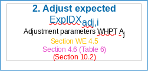
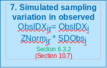
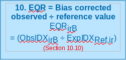

```{r setup, message=F, echo=FALSE, warning=F}
library(rict)
library(knitr)
library(dplyr)
```

```{r, include = FALSE}
knitr::opts_chunk$set(
  collapse = TRUE,
  comment = "#>",
  echo = FALSE
)

options(scipen = 2, digits = 9)
```

```{r results="asis", echo=FALSE}
# directly adding css to output html without ruining css style https://stackoverflow.com/questions/29291633/adding-custom-css-tags-to-an-rmarkdown-html-document
cat("
<style>
img {
border: 0px;
outline: 0 ;
}
</style>
")
``` 

<p align="center" width="100%">
    
</p>

# Introduction 

## Purpose of the document

The purpose of this document is to define the business, functional and
non-functional capabilities of RICT to support the design and implementation of
RICT software tool.
  
The details will be sufficient to enable the software tool to be designed and
built without having to continually refer queries to business representatives.
  
Further, it will be of sufficient detail to provide supporting documented
information for any future RICT development.

## Background

The UK Regulatory Agencies have a requirement to classify ecological quality in
rivers using data from invertebrate samples. The RIVPACS (River Invertebrate
Prediction and Classification Tool) model and software tool, which was developed
on behalf of the agencies by the Freshwater Biological Association (FBA) and
subsequently by the Centre for Ecology and Hydrology (CEH), was originally used
for this purpose. It incorporates a set of summarised reference data from sites
assumed to be the best available of their type.
  
The EU Water Framework Directive (WFD) introduced in 2000, included
modifications to the regulatory requirements in relation to classification and
therefore the RIVPACS software processing tool had to be amended.
  
The original RIVPACS software tool was written in FORTRAN and had been developed
in stages over a number of years. As a result, it was not written in a modern
programming language and did not have flexibility to allow changes without
significant cost. Therefore, a new tool was developed that allowed future
changes to be made with minimal cost in many cases (e.g. the addition of a new
index). This was the River Invertebrate Classification Tool (RICT) version 1 which went
live in 2007. This version of RICT was a web-served application which was
accessed via a website hosted by SEPA. The SEPA website also hosted copies of
the manual, guidance and background documents.
  
RICT has had some updates since 2007, including the addition of ‘split season’
classification to enable WHPT (Walley, Hawkes, Paisley and Trigg) calculations
using seasonal average EQRs (Ecological Quality Ratio). RICT was managed and
hosted by Scottish Environment Protection Agency (SEPA) but is also used by
Environment Agency (EA), Natural Resources Wales (NRW) and Northern Ireland
Environment Agency (NIEA) as part of their regulatory and statutory requirements
as well as public users such as academic institutions.
  
However, a number of issues were identified with this version of RICT which can
be found in the outline business case produced by the scoping project. These
include improving the performance, support arrangements and resilience as well
as adding the new RIVPACS model (RIVPACS version IV) to the RICT tool, resolving
critical bugs and other additional functionality. The full list of Critical
success factors can be found in Annex C.
  
A shortlist of options to resolve the issues was discussed which resulted in the
recommendation that RICT should adopt a Platform as a Service arrangement and
run a modified application.
  
A new cloud-based open source version of RICT was developed which 
incorporated the current RIVPACS IV model and WFD status classification and uses
the same basic algorithms to provide the same final results (other than
correction of errors). Code and data tables for the new version will be more
accessible to developers who wish to further develop RICT. This new version of RICT is called RICT version 2 (RICT2).
  
The platform chosen for RICT2 was Microsoft Azure Machine Learning (ML) Studio
with open source R programming language. Due to Azure closing down this service, the platform moved to a 'Shiny' web server hosted by Posit. This version is called RICT version 3 (RICT3). The code was moved to an R package on Github.

Advanced
users can create their version of R code or run the R package locally on their machines.
  
The RICT web app and latest documentation including
the technical specification and user guide via [RICT web app](https://rictapplications.shinyapps.io/rictapp/).

# Functional Overview 

RICT is an application that implements the RIVPACS IV predictive model. The
primary requirement of the tool is to allocate WFD (Water Framework
Directive) compliant classifications to rivers with regard to the quality of the
river invertebrate community.
  
The classifications are calculated and described as H() = high, G = good, M =
moderate, P = poor or B = bad. This is achieved by comparing sample data
from a river site against sample data previously taken from river sites
considered to be the best available of their type.
  
The primary functions of the RICT tool are:

1. **Predict** - Predict the value of various biotic indices and the presence and abundance of invertebrate species, genera or
  families that you would expect at any place on any stream or river in the UK
  if it was not environmentally disturbed.
  
2. **Classify** - Determine the Water Framework Directive (WFD) quality status
   class and statistical information about its confidence.
  
3. **Compare** - Compare the statistical significance of differences between
   classifications.
  
It is to be capable of doing this for one or more sites at a time, with the
results provided in an output file for subsequent processing by the relevant
user.
  
The diagram below shows a diagrammatical representation of the main
functionality of the RICT tool with numbered links to more detailed
information.

# Supporting files
  
RICT uses the RIVPACS reference data which contain sites that are considered to
be the best available of their type. The latest version of the complete RIVPACS
reference database for RICT can be downloaded from the RICT Website:
  
https://fba.org.uk/FBA/Public/Discover-and-Learn/Projects/RIVPACS-Reference-Sites-and-Reports.aspx
  
Within RICT, the RIVPACS reference data is not used at site level but is used
at the End Group level, where an End Group contains combined data for sites
considered to be of a similar biological composition. End Groups are grouped up
to End Group Sets (e.g. New GB – 43 Group level).
  
As well as this data table, RICT needs other data which will be held and used
as internal data tables and R software code functions.

All the following files can be found within the rict package on
[github](https://github.com/aquaMetrics/rict).

The rict code  is automatically tested and compiled/built on every update to the
master branch on Github. This process is carried out by the Github actions
website, which monitors repo for any changes and re-builds and tests the code
on a Windows, Mac and Linux machine in the cloud. It then automatically deploys updates to the web app and/or documentation.
  
## Prediction

### Support Tables:
  
These files can be found in the inst/extdat folder within the rict package.
  
**Model 1 specific:**
  
* `df-coeff-gb-685.DAT` – used for Discriminant score.
* `df-mean-gb-685.DAT` - used for calculating Mahanalobis distance.
  
**Model 44 specific:**
  
* `discrimintant-function-coefficient-model-44.csv` - used for discriminant score.
* `discrimantinant-function-model-44.csv` file used for calculating Mahanalobis distance.

**For both models:**
  
* `air-temp-grid.csv` – contains previously derived Environmental data values for the Mean Air Temperature (TEMPM) and Temperature range (TEMPR) for points in the centres of 5km interval grid squares. Values are used after converting the supplied NGR (or BNR) to latitude and longitude to identify the relevant values required. 
* `end-grp-assess-scores.csv` used for calculating proportion during prediction.
* `TAXA_AB_APR_PRAB.csv` - containing abundance and probability of abundance category for each taxon used in predicting taxa. 
* `x-103-end-group-means-formatted-jdb-17-dec-2019.csv` – combined data for sites considered to be of a similar biological composition the End Group table used in RICT is called
  
### Prediction Functions:

Found in the `/R` package directory there are two main R functions files for predictions:
  
`rict-predict.R` - main function called to run prediction  
`rict-validate.R` - lower level function to validate input data 
`helper-functions.R` - support functions to carry out the Environmental Variables validation  
  
Prediction support functions are found:
  
`prediction-functions.R`   
`calc_temperatures.R  `  
  
## Classification

### Files Supporting: 

* `adjustParams_ntaxa_aspt.csv` - reference adjustment values.
* `EndGrp_AssessScores.csv` - Excel csv used for adjusting the expected values during classification for calculating proportion.
  
**Note**, no classification is carried out on the 80 indices – carried out for Prediction only!
  
A list of the tables and functions required for the NI model below:
  
* `DFCOEFF_NI.DAT` file used for Discriminant score as described in section 7.5 of this document.
* `DFMEAN_NI_RALPH.DAT` file used for calculating Mahanalobis distance as described in section 7.6 of this document.j
* `EndGrp_AssessScores.csv` file used for calculating proportion during prediction.

### Classification Functions:

* `classification-functions.R` - A large number of R code functions used during the prediction process as described in Section 8.

### Classification support files: 
  
* `adjustParams_ntaxa_aspt.csv` containing reference adjustment values which are used as described in Section 8.2.
* `EndGrp_AssessScoresNI.csv` used for adjusting the expected values during classification as described in Section 8.2.
  
All source code and support files can be downloaded into R environment for
example Rstudio from Github for users who wish to amend and create their own
versions.

# RICT  

## Default values

The list below describes the default values used:
  
* Number of Monte-Carlo simulations – 10,000
* Index sets – all 80 indices
* Season type – Spring, Autumn, Spring/Autumn Combined, Summer
* Classification boundary limits – Coded as per WFD compliant values found in
the classification support files (user would need to amend the function in this
file to alter values for their own version)
* Bias - Bias values can be provided in the input file by the user and will be
used if provided. However, if no data values
for Bias or "-9" has been entered in the input file, then the hard-coded default
value of 1.62 (GB) or 0 (NI) will be used.
  
Note that 1.62 is the default value currently being used for Bias as this was
input as the default value in the previous version of RICT as used in SEPA for
BMWP NTAXA. However, the EA uses a value of 1.68 as the Bias value for WHPT
which was based on an audit of the analytical quality of Environment Agency
laboratories. The Bias value for WHPT should be greater than the value for BMWP
for the same level of analytical quality, because WHPT uses more taxa than BMWP.
Plus WHPT taxa also includes additional Diptera families which are less easy to
identify.

## Future Developments

A multi-site classification will be added to enable water bodies to be
classified from more than one site. The GIS data location checker and delivery
system and multi-site classification are currently in development and we hope to
release them in a couple of months.

Additional standard default to calculate the output for more
specific Index sets (e.g. for hydro-ecological evaluation) may be added later,
if the need arises.
  
Future RICT release may allow a user to run predictions and classifications
against previous classifications and RIVPACS models to allow historical data to
be analysed in a consistent way with current monitoring data. That may include
BMWP (Biological Monitoring Working Party) classification based on RIVPACS IV
(used before 2015) or RIVPACS III+ (used 1990-1009), or using WHPT based on BMWP
taxa including BMWP composite taxa.
  
We may correct or improve features, if we need to do that, we will run them through testing and add to this document and user
guides, as appropriate.
  
# Acceptance and validation of input data

In order to be able to predict and classify, the tool requires input data in one
csv file which includes:
  
* Site Identifier
* Values for a number of Environmental Variables (e.g. NGR, slope, discharge, etc.)
* Values for a number of Observed Tool Indices (e.g. ASPT, NTAXA, etc.) (only
required for classification)
  
An excel spreadsheet template will be provided for the user to enter input data
into the relevant column headings. Validation rules will be applied to the data
that has been input for each column to help the user meet the validation
requirements detailed below.
  
The input data spreadsheet template can be found in Annex A of this document.
Once completed, this spreadsheet will need to be saved as a csv format and
uploaded by the user.
  
## Environmental Variable Values and Validation

Environmental Variables (EV) are needed to enable the prediction process to
calculate the probability of end group membership. The values of some
Environmental Variables are provided and input by the user. The values of other
Environmental Variables have to be derived using the values of one or more
provided Environmental Variables and then converted. The complete set of input
and derived Environmental Variables used by RICT are called Predictive
Environmental Variables (PEVs).
  
The tables below refers to the Environmental Variable data required and the data
field validation for the RIVPACS IV Great Britain and Northern Ireland Model M1
and additionally the model M44. The M1 model requires input of 13 PEVs for Great
Britain and 11 PEVs for Northern Ireland. M44 model required 17 PEVs.
  
Input file screening will be carried out using the rules described in the tables
below when a user enters data into the input file spreadsheet. This will be done
by the conditional formatting tool within the MS Excel ribbon to check and
highlight to the user where data does not meet validation requirements. It will
highlight failures in red and warnings in orange. However, it will not stop the
user from supplying that data to RICT for processing. When RICT processes the
data, the appropriate Fail and Warn errors will be generated as described below.
  
Validation has also been coded into RICT for validation of the value ranges,
i.e. “all”, “gb” and “ni”.
  
Note that at least one set of the following data will be required for each site
but there may be up to three sets of data where the ‘raw’ data is being provided
for up to three years for multi-year classification.
  
#### Input variables

All input variables as well as their validation rules are listed in the
validation-rules.csv file within the package. The tables below are generated
from this file.

#### Model 1 User input file

Required values (including using physical predictors) :

```{r}
validation_rules <-
  utils::read.csv(system.file("extdat", "validation-rules.csv", package = "rict"),
    stringsAsFactors = F
  )

kable(filter(validation_rules, models %in% c("all", "physical") & source == "input") %>%
  select(
    Variable = "variable",
    Units = "units",
    Description = "pretty_name",
    Type = "type",
    Optional = "optional"
  ) %>% unique())
```

#### Model 44 Input files (using GIS predictors) 

Required values:
  
```{r}
kable(filter(validation_rules, models %in% c("all", "gis") & source == "input") %>%
  select(
    Variable = "variable",
    Units = "units",
    Description = "pretty_name",
    Type = "type",
    Optional = "optional"
  ) %>% unique())
```

#### Optional values

Columns containing optional values must still be present in input data file but
all or some of their values may be missing (data type NA). However, they must
comply with the following notes:

#### Model 1 Optional notes:

```{r}
kable(filter(validation_rules, models %in% c("all", "physical") &
  source == "input" &
  optional_notes > 0) %>%
  select(
    Variable = "variable",
    "Optional note" = "optional_notes"
  ) %>% unique())
```

#### Model 44 Optional notes:

```{r}
kable(filter(validation_rules, models %in% c("all", "gis") &
  source == "input" &
  optional_notes > 0) %>%
  select(
    Variable = "variable",
    "Optional note" = "optional_notes"
  ) %>% unique())
```

#### Validation

Warnings: Where the value of an environmental input variable exceeds a
“Warn” limit, the prediction process will continue but warning message is
created for that particular site.
  
Fails: Where the value of an environmental input variable exceeds a “Fail”
limit, the prediction process will not proceed for that particular site and
flags the transgression in a fail message.

#### Validation rules for Model 1

```{r}
knitr::kable(filter(validation_rules, models %in% c("all", "physical")) %>%
  select(
    Variable = "variable",
    Area = "area",
    "Less than fail" = "less_than_fail",
    "Greater than fail" = "greater_than_fail",
    "Less than warn" = "less_than_warn",
    "Greater than warn" = "greater_than_warn"
  ))
```

Model 1 Validation notes:
```{r}
kable(filter(validation_rules, models %in% c("all", "physical") &
  source == "input" & validation_notes != "") %>%
  select(
    Variable = "variable",
    "Validation notes" = "validation_notes"
  ))
```

#### Validation rules for Model 44

```{r}
kable(filter(validation_rules, models %in% c("all", "gis")) %>%
  select(
    Variable = "variable",
    Area = "area",
    "Less than fail" = "less_than_fail",
    "Greater than fail" = "greater_than_fail",
    "Less than warn" = "less_than_warn",
    "Greater than warn" = "greater_than_warn"
  ))
```

Model 44 validation notes: 
```{r}
kable(filter(validation_rules, models %in% c("all", "gis") &
  source == "input" & validation_notes != "") %>%
  select(
    Variable = "variable",
    "Validation notes" = "validation_notes"
  ))
```

#### Replacement values

If values are provided that are zero (or close to zero) they are replaced to
avoid divide by zero errors. Specifically, variables that are used in the
RIVPACS model discriminator functions in their log form (as you cannot take logs
of zeroes):

```{r}
kable(filter(validation_rules, models %in% c("all", "gis", "physical") & source == "input" &
  replacement_val != "") %>%
  select(
    Variable = "variable",
    Model = "models",
    Area = "area",
    "Replacement value" = "replacement_val",
    "Replacement condition" = "replacement_cond",
    "Replacement limit" = "replacement_limit"
  ) %>% unique())
```

### Validation rules

The min/max validation rules are stores in the `validation-rules.csv`. This can
be updated with new min/max validation as required. The more complex validation
rules for example checking the presence of optional columns are hard-coded into
the `rict_validation()` function.

### Environmental Variables Validation Process

Some initial validation is done if the user (as recommended) enters data into
the input spreadsheet:

* Spreadsheet validation is carried out to check that the Environmental Values are present and they are the correct format as user enters data.

The user then inputs the values into RICT and the software carries out
further validation:
  
If any columns are missing when data is imported to RICT the program fails.
    
* Check against ‘Overall’ Valid Max/Min Values
* Check that each provided EV value is greater than or equal to the ‘overall’ minimum value and less than or equal to the ‘overall’ maximum value defined in the Environmental Variable parameter table above.
* Within RICT code, if the values do not meet the validation criteria the site is flagged as a failure and that particular site is removed from the run.
        
The fail limits are based on the minimum and maximum values likely in GB or NI.
Values exceeding these limits must be wrong.
  
* Check against ‘Warning’ Max/Min Values
* Check that each provided EV value is greater than or equal to the ‘warning’ minimum value and less than or equal to the ‘warning’ maximum value defined in the Environmental Variable parameter table above.
* If not, then this should be recorded so that it can be flagged as a ‘warning’ in the output file but the software will proceed as normal. 
      
The warning limits are the minimum and maximum values of the variables in the
RIVPACS reference database for reference sites included in RIVPACS IV GB or NI.
Exceedences indicate that the site is beyond the scope of the model and may be
the cause of poor suitability and they could indicate errors.  Exceeding
longitude and latitude is less serious that exceeding other parameters.
  
## Observed Biological Data Values and Validation

Biological data is needed to enable the classification process. The values of
the Biological data is provided by the user.
  
The table below refers to the data items required and the data field validation
for the RIVPACS IV Great Britain Model 1 and for the RIVPACS IV Northern Ireland
Model 1.
  
Conditional formatting validation will be carried out for all of the validation
rules described in the table below when a user enters data into the input file
spreadsheet. There is no validation for the Observed Biological data within
RICT.
  
However, RICT will validate that relevant values have been provided from the
prediction process prior to the classification process. This
is to check that there are no null values if these values are required for the
classification to be successful.
  
Note, this data will need to be entered for each season as relevant. For WFD classification, this will be data for spring and autumn.
  
Data Item  
Validation  
Season ID  

Season_ID must be numeric single digit code, i.e. from list:
  
* 1 = spring
* 2 = summer  
* 3 = autumn  
* 4 = spring + summer  
* 5 = spring + autumn  
* 6 = summer + autumn  
* 7 = spring + summer + autumn  
  
See All Indices table with new labels   
Must be numeric integer (i.e. whole number)  
Bias (Ntaxa_Bias) Must be numeric  

# Conversion of Input Environmental Variables

The values for some input environmental variable data needs to be converted to
particular values that are required for the prediction process. These are as
follows:
  
* NGR converted to latitude and longitude
* Calculate mean air temperature and temperature range from latitude and longitude (GB only)
* Calculate Mean Substratum Composition
* Estimating Discharge Category (if unavailable) from Stream Velocity
* Estimating Alkalinity (if unavailable) from Hardness, Calcium or Conductivity. In addition, some EVs then need further conversion
* NGR convert many EVs to logarithms
* Replace values of some EVs to prevent arithmetical problems, such as division by zero
  
The required conversion rules and some validation rules that need to be applied
are described below.

## Convert Grid References 

Grid references consists of:  
  
nat_grid_ref	= 2 letters for the British National Grid (BNG) or 1 letter for the
Irish grid specifying a  100km x 100km grid square
  
easting	= 3 digit Easting within the 100km grid square (to nearest 100m)
  
northing	= 3 digit Northing within the 100km grid square (to nearest 100m)
  
To derive latitude and longitude, the NGR input by the users is run through `getLatLong()` in the `helper-functions.R` file. 
   
This code converts the grid references to Latitude and Longitude WGS84 system.
This co-ordinate system is required to calculate Long Term Average Mean
Temperature and Range of Air Temperature environmental variables.
  
The specific function code used within `helper-functions.R` is as below:
  
`getLatLong <- function(nat_grid_ref, easting, northing, coordsys_latlon, area)`
  
where:  
  
`nat_grid_ref`, are the grid letter(s), `easting` and `northing` from the user input file,
`coordsys_latlon` uses the WGS84 system as described above and `area` is `gb` or `ni`.

NOte, GIS model 44 data provides Lat/Lon in BNR in SX and SY columns. These are converted to lat and lon
in the rict_validate.R function.

##  Latitude and Longitude for NI

Same as above - `using area = "ni"` within `getLatLong()` function.

## Calculate Air Temperature

This conversion process is only applicable to GB model sites.
  
When converting Latitude and Longitude to Long Term Average Mean Temperature and
Range of Air Temperature, RICT uses a data file containing previously derived
values for Mean air temperature and Air temperature range for points in the
centres of 5km interval grid squares. This data file can be found in the
inst/ext directory and is called `air-temp-grid.csv`.
  
To calculate Long Term Average Mean Temperature and Range of Air Temperature,
the Latitude and Longitude previously derived is run through
`calc-temperatures.R` within the prediction support files folder.
  
The specific function code used within `calc-temperatures.R` is as below:  
  
`calculated_temps <- calcTemps(coordinates)`  
  
where:  
  
coordinates are the eastings and northings (lat, long) calculated values as described in Section 6.1 

```
# R version originally written by by C. Laize CEH in early 2012
# Based on FORTRAN PROGRAM TEMPGRID
# For QC and traceability, followed the FORTRAN code as closely as possible; not necessarily best R code
# Converted to calc.temps function by M Dunbar, Environment Agency April 2018

# Modified by T Loveday to avoid errors on east coast, Environment Agency May 2019 
# Modified by T Loveday Environment Agency Mar 2020 to improve look and performance
############################################

#Program to calculate mean temperature and annual temperature range

calc.temps <- test1<-function(coordinates){
# coordinates is a data frame with three columns
# SITE_ID
# EASTING4
# NORTHING4
  
# this function will know about AirTempGrid because it will have been defined in the global environment just
# before the function has been called. This isn't great programming practice, but will do for now.
  
SMEAN<-NULL
SRANGE<-NULL

TempGrid_out<-data.frame()
for (l in c(1:nrow(coordinates))) {#0
if(nchar(coordinates$Site_ID[l])<4) {
  for(z in c(1:(4-nchar(coordinates$Site_ID[l])))){
    coordinates$Site_ID[l]<-paste("0", coordinates$Site_ID[l],sep="")
  }
}

NP<-0
subsetATG1 <- NULL
IGEAST<-coordinates$Easting[l]    #============================================================
						#remember to change back
IGNORTH<-coordinates$Northing[l]  #============================================================

KE<-IGEAST-25
KN<-IGNORTH-25

#find nearest 5km-point to sw and distances e and n from that
#although this point might be the below the site location as the first four are derived by adding 50 to east and nort

KSQE<-(trunc(KE/50)*50)+25
KSQN<-(trunc(KN/50)*50)+25

IREME<-IGEAST-KSQE
IREMN<-IGNORTH-KSQN

ME1<-KSQE
ME2<-ME1
MN1<-KSQN
MN2<-MN1

#test if at a 5km-point or a vertical or horizontal between
if (IREME==0 & IREMN==0) {#1 site is coincident with a point possible on the grid
        subsetATG1 <- subset(AirTempGrid,  Easting >= ME1 & Easting <= ME2 & Northing >= MN1 & Northing <= MN2)
	NP<-nrow(subsetATG1) ;SMEAN<-subsetATG1$TEMPM ;SRANGE<-subsetATG1$TEMPR

	if(NP==1){#2
	} else {#2 if the point is not present in the tempgrid file the search is expanded to the surrounding 8 squares 
        	subsetATG1 <- subset(AirTempGrid,  Easting >= ME1 -50 & Easting <= ME2 + 50 & Northing >= MN1 -50 & Northing <= MN2 + 50)
		NP<-nrow(subsetATG1)
		if(NP>3){#3
		} else {#3 if 3 of the 8 points are not present in the tempgrid file the search is expanded to the surrounding 24 squares 
			subsetATG1 <- subset(AirTempGrid,  Easting >= ME1 -100 & Easting <= ME2 + 100 & Northing >= MN1 -100 & Northing <= MN2 + 100)
			NP<-nrow(subsetATG1)
			if(NP<4){NP<-0} else {}#4
			}#3
		}#2	
} else {#1
		if (IREME==0) {#5 site lies on the N/S line of a point which may or may not be in the temp grid
			subsetATG1 <- subset(AirTempGrid,  Easting == ME1  & Northing >= MN1 & Northing <= MN2 + 50)
			NP<-nrow(subsetATG1)
			if(NP==2){#6
			} else {#6 if either point is absent the search is expanded to E and W to give a potential max no of points of 6
				subsetATG1 <- subset(AirTempGrid,  Easting >= ME1 -50 & Easting <= ME2 + 50 & Northing >= MN1 & Northing <= MN2 + 50)
				NP<-nrow(subsetATG1)	
				if(NP>3){#7
				} else {#7 if less than 4 of the possible 6 points are present the search is expanded N and S to give a potential max no of points of 12
					subsetATG1 <- subset(AirTempGrid,  Easting >= ME1 -50 & Easting <= ME2 + 50 & Northing >= MN1 -50 & Northing <= MN2 + 100)
					NP<-nrow(subsetATG1)
					if(NP<4){NP<-0} else {}#8
					}#7	
				}#6	
		} else {#5
				if (IREMN==0) {#9					
					subsetATG1 <- subset(AirTempGrid,  Easting >= ME1  & Easting <=  ME2 + 50 & Northing >= MN1 & Northing <= MN2)
					NP<-nrow(subsetATG1)
					if(NP==2){#10						
					} else {#10
						subsetATG1 <- subset(AirTempGrid,  Easting >= ME1  & Easting <=  ME2 + 50 & Northing >= MN1 -50 & Northing <= MN2 +50)
						NP<-nrow(subsetATG1)
						if(NP>3){#11
						} else {#11
						subsetATG1 <- subset(AirTempGrid,  Easting >= ME1 -50  & Easting <=  ME2 + 100 & Northing >= MN1 -50 & Northing <= MN2 +50)
						NP<-nrow(subsetATG1)
						if(NP<4){NP<-0} else {}#12
							}#11
						}#10
				} else {#9
						#must interpolate between 4 values if none of the above is satisfied
						subsetATG1 <- subset(AirTempGrid,  Easting >= ME1  & Easting <=  ME2 + 50 & Northing >= MN1 & Northing <= MN2 +50)
						NP<-nrow(subsetATG1)
						if(NP>2) {#13
						} else {#13
								subsetATG1 <- subset(AirTempGrid,  Easting >= ME1 -50  & Easting <=  ME2 + 100 & Northing >= MN1 -50 & Northing <= MN2 +100)
								NP<-nrow(subsetATG1)
								if(NP<4){
									NP<-0
									} else {}#14	
							}#13
					}#9	
			}#5
	}#1
#write.csv(subsetATG1 ,"Subset.csv", row.names = FALSE, append = FALSE)
if(NP==0){
	smean<-0
	srange<-0
	}else{
	if(NP==1){ 
		smean<- subsetATG1$TEMPM
		srange<- subsetATG1$TEMPR
		}else{
		subsetATG1$D<-(subsetATG1$Easting-(KE+25))^2+(subsetATG1$Northing-(KN+25))^2
		ifelse(subsetATG1$D!=0.000000, subsetATG1$DS<-1/subsetATG1$D, subsetATG1$DS<-0.01)
		smean<- sum(subsetATG1$TEMPM/subsetATG1$D)/sum(subsetATG1$DS)
		srange<- sum(subsetATG1$TEMPR/subsetATG1$D)/sum(subsetATG1$DS)
		}
	}
print(paste(coordinates[l,1],NP, smean, srange))
TempGrid_out<-rbind(TempGrid_out, cbind(coordinates[l,], smean, srange))
}#0
TempGrid_out<-as.data.frame(TempGrid_out)
#write.csv(TempGrid_out,"TempGrid.csv", row.names = FALSE, append = TRUE)
}
```

The temperature grid below is used to obtain mean air temperature and mean air
temperature range for RICT predictions. The dots represent points on the
existing temperature grid if the site has exactly the same coordinates as the
centre point
  
**Key**

`0` Available data point  
`1` Data point included in the sample  
`5` Nearest point on the existing temperature grid to the site
  
1. If the site has exactly the same coordinates as the centre point

If the point has exactly the same coordinates as the centre point it samples
only the centre point to provide the temperature mean and range if that point
exists in the dataset:

```  
0 0 0 0 0  
0 0 0 0 0  
0 0 1 0 0  
0 0 0 0 0  
0 0 0 0 0 
```

If the centre point doesn't exist in the above example then the surrounding 8
points are sampled, if more than 4 of the 8 pts are present within the dataset a
value is returned:

```
0 0 0 0 0   
0 1 1 1 0   
0 1 5 5 5   
0 1 1 5 5   
0 0 0 0 0   
```

If the above condition is not satisfied then the sampling is expanded to include
the adjacent points, if at least 5 of the 24 possible points are available a
result is returned - if less than 5 no result is returned:

```
1 1 1 1 1     
1 1 5 5 5 
1 1 5 5 5  
1 1 5 5 5   
1 1 1 1 1   
```

2. If the site lies exactly on the N/S line of the centre point
  
If the point lies exactly on the N/S line of the centre point then the nearest
point and the one above are sampled if both points are present in the dataset:

```
0 0 0 0 0   
0 0 1 0 0   
0 0 1 0 0   
0 0 0 0 0   
0 0 0 0 0   
```

If one of the two points above is not present in the dataset then the two either
side are also sampled, if more than three points are present a result is
returned:

```
0 0 0 0 0  
0 1 5 1 0  
0 1 1 1 0  
0 0 0 0 0  
0 0 0 0 0  
```

If less than 4 of the 6 points above are present in the dataset then the three
above and below are also sampled if that at least 4 of the 12 are present a
result is returned:

```
0 1 1 1 0  
0 1 5 5 0  
0 1 1 5 0  
0 1 1 1 0  
0 0 0 0 0  
```

3. if the site lies exactly on the E/W line of the centre point

If the point lies exactly on the E/W line of the centre point then the nearest
point and the east of it will be sampled if both points are present in the
dataset:

```
0 0 0 0 0  
0 0 0 0 0  
0 0 1 1 0  
0 0 0 0 0  
0 0 0 0 0  
```
If one of the two pointts above are not present in the dataset then the two
either side are also sampled, if more than three points are present a result is
returned:

```
0 0 0 0 0  
0 0 1 1 0  
0 0 1 1 0  
0 0 1 1 0  
0 0 0 0 0   
```

If less than  4 of the 6 points above are  present in the dataset then the three
east and west are also sampled assuming that at least 4 of the 12 are present:

```
0 0 0 0 0  
0 1 5 5 1   
0 1 1 5 1   
0 1 1 1 1   
0 0 0 0 0  
```

4. If none of the above are satisfied - the majority of sites. The site is not coincident with any point or the n/s or e/w line of any point.
  
Interpolates between four values, 3 of the 4 points must be present to return a
value:

```
0 0 0 0 0  
0 0 1 1 0  
0 0 1 1 0  
0 0 0 0 0  
0 0 0 0 0  
```

If the above is not satisfied then the sampling is expanded to take in 16 points
of which 5 or more must be present:

```
0 1 1 1 1  
0 1 1 5 5     
0 1 1 5 5    
0 1 1 1 1  
0 0 0 0 0  
```

## Calculating Mean Substratum Composition

MSUBST (in phi units) is derived from the following user-supplied environmental
variables  from the input file for the river bed substratum composition observed
at the sampling site:

```
BOULDER_COBBLES	= percentage cover of Boulders/Cobbles  
PEBBLES_GRAVEL	= percentage cover of Pebbles/Gravel  
*SAND	= percentage cover of sand  
*SILT_CLAY	= percentage cover of silt/clay  
```

The Algorithm used is:
  
```
TOTSUB = BOULDER_COBBLES + PEBBLES_GRAVEL + SAND + SILT_CLAY
MSUBST = ( -7.75*BOULDER_COBBLES - 3.25*PEBBLES_GRAVEL + 2*SAND + 8*SILT_CLAY ) / TOTSUB
```
  
The specific function code `get_substrate` used can be found within helper-functions.R

## Estimating Discharge Category

If a value for discharge category (DCH) is not supplied by the user for the test
site, it is to be estimated from a measurement of surface water velocity
category (VEL) supplied by the user. If neither value is provided then an error
will be recorded against the site and prediction and classification should not
take place for that site.
  
The conversion from user-supplied velocity category (VEL) to discharge category
(DCH) is done by:
  
1. Converting the velocity category (VEL) to an estimate of some sort of mid- or typical actual velocity

|Velocity category VELC(VEL) |Velocity Category(VEL) (cm.s^-1^) | Mid-range estimate VELC(VEL) (cm.s^-1^)|
|:---------------------------|:-------------------------------|:-------------------------------------|
|1                           |≤10                             |5                                     | 
|2                           |>10 – 25                        |17.5                                  | 
|3                           |>25 – 50                        |37.5                                  | 
|4                           |>50 – 100                       |75                                    | 
|5                           |>100                            |150                                   | 


2. Then use the equation `RDCH = DEPTH/100 * WIDTH * VELC(VEL)/100` to convert the estimated velocity VELC(VEL) into an estimated actual mean discharge RDCH in cumecs

3. Finally, assign the estimated discharge RDCH to the appropriate discharge category DCH based on the discharge category upper limits below

|Discharge Category DCH |Mean annual discharge RDCH(m3.s^-1^ = cumecs)|
|:----------------------|:-------------------------------------------|
|1                      |< 0.31                                      |
|2                      |0.31 - 0.62                                 |
|3                      |0.62 - 1.25                                 |
|4                      |1.25 - 2.50                                 |
|5                      |2.50 - 5.00                                 |
|6                      |5.00 - 10.00                                |
|7                      |10.00 - 20.0                                |
|8                      |20.00 - 40.0                                |
|9                      |40.00 - 80.0                                |
|10                     |>80                                         |

The FORTRAN algorithm for estimating DCH from Stream Velocity is: 

```
DATA cdch / 0.31, 0.62, 1.25, 2.5, 5.0, 10.0, 20.0, 40.0, 80.0 /  
CDCH(1) = 0.31  
CDCH(2) = 0.62  
CDCH(3) = 1.25  
CDCH(4) = 2.50  
CDCH(5) = 5.0  
CDCH(6) = 10.0  
CDCH(7) = 20.0  
CDCH(8) = 40.0  
CDCH(9) = 80.0  
  
VELC(1) = 5.0  
VELC(2) = 17.5  
VELC(3) = 37.5  
VELC(1) = 75.0  
VELC(1) = 150.0  
RDCH = DEPTH/100. * WIDTH * VELC(VEL)/100  
K=10  
REPEAT	  
DCH=K  
K=K-1  
UNTIL RDCH>CDCH(K)`
```

The specific function code is `get_discharge()` used can be found within helper-functions.R.

## Estimating Alkalinity

If a value for alkalinity (ALK) is not supplied by the user for the test site,
then it is to be assumed that alkalinity is to be estimated from, in order of
preference, the user-supplied values for either water hardness (HARD), calcium
concentration (CALCIUM) or conductivity (CONDUCT).

If none of these values are provided then an error should be recorded against
the site and prediction and classification should not then take place for that
site.

The algorithm for estimating Alkalinity from the other values is: 

```
IF HARD is provided THEN  
ALK = 4.677 + 0.6393*HARD  sudo apt install font-manager
ELSE  
IF CALCIUM is provided THEN  
ALK = 14.552 + 1.7606*CALCIUM  
ELSE  
IF CONDUCT is provided THEN  
ALK = 0.3201*CONDUCT -8.0593
```

The specific helper function is `get_alkalinity()`.

## Transform Environmental Variables
  
Some environmental predictor variables are used in discriminant functions in a
logarithm to base10 transformed form (denoted Log10). They, therefore, need to
be converted prior to prediction.
  
The discriminant functions for the Great Britain (GB) model (Reference end group
set 1) use 13 environmental predictor variables (i.e. vN = 13), as detailed
below.
  
The Northern Ireland (NI) model (Reference end group set 2) uses the same set of
variables apart from air temperature mean (TEMPM) and air temperature range
(TEMPR), which were not available for Northern Ireland and probably would not
add discriminatory power within this relatively small geographic region.
  
For the purposes of specifying the discriminant functions and inputting their
coefficients (DFCoeff<sub>v,d</sub>), RICT will have a `helper-functions.R` file
(among the support files) for the Northern Ireland model.
  
Some of the environmental predictor variables are used in the discriminant
functions in a logarithm to base 10 transformed form (denoted Log<sub>10</sub>), as
detailed below.

Specific functions within the `helper-functions.R` will do the conversions as
described in Sections 6.1 – 6.6 above and will also calculate to log base 10 for
any Environmental variables that require Log Base 10 form.
  
The precise order and form of the environmental variables to be used as Env 1–
Env<sub>vN</sub> in the discrimination functions equations used to calculate the
discriminant function axis scores (DFScore) is as follows:

```{r}
filter(validation_rules, models %in% c("physical", "all"), env > 0) %>%
  arrange(ev_number) %>%
  select(
    "EV" = "env",
    "User input" = "variable",
    "Environmental predictor variable" = "pretty_name",
    "Derived" = "source",
    "Use in log10 form?" = "log"
  ) %>%
  unique() %>%
  kable()
```

** Alkalinity is involved in the discriminant functions in both untransformed form (as Env9) and in log transformed form (as Env10) to represent its non-linear impact on the biota.

This table also shows which EVs are supplied by the user in the input file and
which EVs are internally derived by RICT conversions.

## Validation of Derived Environmental Variables

Whenever the value of an Environmental variable is derived from any conversion
applied, it needs to be validated against the various max/min values. There are
two distinct max/min values; Fail and Warn and the required validation is as
detailed previously in section 5.
  
Once all the conversion processing has been carried out, then this should result
in a value being present for every required Environmental variable.  This
complete set of Environmental variables is called the Predictive Environmental
Variables (PEVS).
  
# Prediction

## Prediction Process

The prediction functionality involves four distinct steps:
  
a) determine the probability of end group membership  
b) determine Environmental Suitability  
c) based on a), determine the predicted index values for the indices relevant to the run  
d) based on a), determine the predicted taxa to be present at the site  
  
The most complex part of this is a), which involves the use of multiple
discriminant analysis and specialised statistical techniques (e.g. Mahanalobis
Distance).
  
It needs to be carried out for every set of site data applicable to the run (a
site may be present more than once where more than one years’ worth of
environmental data has been provided).
  
The flow diagram below summarises the prediction process and calculations
(including the data input, validation, conversion and transform steps described
above) as well as identifying the relevant section for further information from
the WFD72C final report:


## Prediction Overview
  
The probability of a site belonging to an End Group is determined by the
similarity of its Environmental Variables (EVs) to those of the relevant End
Group.
  
Due to the multivariate nature of the environmental variable data, Multiple
Discriminant Analysis (MDA) is used to turn the environmental variable data into
a format that can be used to discriminate between the end groups.
  
MDA depends on multiple Discriminant Functions (DF). A Discriminant Function has
the general format:-
  
```
Z = constant + c1EV1 + c2EV2 + c3EV3 + ... + cnEVn
```
  
where Z is the Discriminant Score (DS) for that particular discriminant
function, c1…cn are the coefficients of that discriminant function and EV1…EVn
are the values of the environmental variables.
  
A DF is a linear combination of the EVs and the coefficients, which maximises
the separation in data space of the end groups. In other words, if the
discriminant function was solved for the mean values of the environmental
variables of each end group and the results plotted on a line, the value from
the solved formula for each end group would be as far apart from its nearest
neighbour as could be achieved by using the available environmental variables to
separate the end groups

## Environmental Variables

The values of the EVs relevant to the prediction run will have been determined
during the acceptance, validation and subsequent conversion processing of the
input data as described in section 5 and 6 of this document. These are referred
to in the algorithm below as EnvvN.

## Discriminant Functions and Coefficients

The RIVPACS model used will determine the  Discriminant Functions (DFs) that
have to be run. For the GB model 1 with 13 EVs the DFs values can be found in
the inst/ext folder for GB in a file called DFCOEFF_GB685.
  
For the GB model 44 with 17 EVs the DFs values can be found in the prediction
support files folder for GB in a file called
`discrimant-function-coefficients-model-44.csv` - see section 12 for additional
Model 44 information.
  
For the NI model with 11 EVs, the DFs values can be found in the prediction
support files folder for Northern Ireland in a file called `DFCOEFF_NI`
  
These are separate occurrences of DF. Each of these has a single ‘constant’ and,
for each component EV, a co-efficient that is to be applied to the EV value. The
coefficients are referred to in the algorithm below as DFCoef.

## Calculate Discriminant Function Scores

(Step 4 in diagram above) 

{ width=200px }

The functions that RICT uses for the calculations in the steps below (steps 4 -
8) can be found in the prediction-functions.R file. The algorithms and
definitions provided below are copied from WFD72C and have been used to create
the functions.
  
For each DF, the Discriminant Score needs to be calculated as follows:
    
DFScore~d~ = DFCoef~1,d~ * Env1 + … + DFCoef~vN,d~ * En~vvN~; for d = 1. … dN  

Definitions – these have been copied from WFD72C:
    
v	= id of current environmental predictor variable  
vN	= number of environmental predictor variables  
d	= id of current discriminant function axis  
dN	=  number of discriminant function axes in current Reference end group set  
DFCoef~v,d~ 	= discriminant function coefficient for predictor variable v on  
discriminant function d obtained from the values in the DFCOEFF_GB685 file for  
Great Britain, DFCOEFF_NI file for Northern Ireland or 
discrimant-function-coefficients-model-44.csv for model 44 which can be found
within the prediction support files.  
Env~v~		= value of environmental predictor variable v for the current test site  
DFScore~d~	= discriminant function score on axis d for the current test site   

## Calculate Mahanalobis Distance

(Step 5 in diagram above)

{ width=200px }
  
For a particular End Group g, the probability of End Group Membership is
calculated as follows:
  
- Calculate Mahanalobis distance (MahDistg) of test site from each End Group

```
MahDistg = (DFScore1 - DFMeang,1)2 + ... + (DFScoredN - DFMeang,dN )2 ; for g = 1,...,gN
```

Definitions – these have been copied from WFD72C:
  
g 	= id of current end group (set ID: 1 = GB, 2 =NI)  
gN	= number of end groups in current Reference end group set  
NRef~g~	= number of reference sites in end group g  
DFMean~g,d~	= mean discriminant function score of end group g on axis d
Obtained from the ‘target’ values in the DFMEAN_GB685 file forObtained from the
table x-103-end-group-means-formatted-jdb-17-dec-2019.csv which is within the
inst/ext folder) Great Britain, DFMEAN_NI file for Northern Ireland or
end-group-means-discriminant-scores-model-44.csv for Model 44.  
MahDistg	= Mahalanobis distance of test site from end group g  


## Mahanalobis Distance

Use Mahanalobis distance to determine probability of End Group membership (Step 6 in diagram above):

{ width=200px }

- Calculate the PDistg for each End Group
  
PDist~g~	= NRef ~g~ * EXP(-MahDist~g~/2)  
  
where NRef g = the number of reference sites in the End Group (from the End
Group Reference Data table) and EXP is the natural exponential function
  
* Calculate the PDistTot

PDistTot = PDist~1~ to PDist ~gN~

where gN is the number of end groups in the relevant end group set
  
* Calculate the Probability of End Group Membership (Prob~g~)
     
Prob~g~ = PDist~g~ / PDistTot
  
where Probg is the Probability test site belongs to end group g

  
At the end of this process we end up with a set of probabilities of End Group
Membership, one for each End Group. These are referred to below as Prob~1~ to
Prob~n~.

## Determine Environmental Suitability

Determine environmental suitability of the test site for prediction:

{ width=200px }

(Step 7 in diagram above)

In certain cases it may be calculated that there is a very low probability of
the site being in any of the end groups based on the data provided.
  
In order to highlight this to the user, a calculation is required to allocate an
Environmental Suitability code to the site data indicating the probability the
site belongs to any end group. The potential codes are:
  
* 1   OK
* 2   < 5%
* 3   < 2%
* 4   < 1%
* 5   < 0.1%
  
The required calculation uses the Chi-square values (CQ1 to CQ4) which vary per End Group Set as below:

|End Group set (ID)     |CQ1      |CQ2      |CQ3      |CQ4      |
|:----------------------|:--------|:--------|:--------|:--------|
|RIVPACS IV GB (set 1)  |21.02606 |24.05393 |26.21696 |32.90923 |
|RIVPACS IV NI (set 2)  |18.307   |21.1608  |23.2093  |29.5883  |

`prediction-functions.R` has a
function called getSuitabilityCode() which will do this calculation.
  
The detailed calculation is as follows:
  
* Calculate the minimum Mahanalobis distance (MahDist~min~)  
  
MahDistmin = minimum of (MahDist~1~,….,MahDist~n~) 
  
* Calculate the Environmental Suitability Code and Suitability text
    
If the MahDist~min~ < value for CQ1 then Suitability Code = 1 and suitability text is >5%
  
If the MahDist~min~ >= value for CQ1 and < value for CQ2 then Suitability Code = 2 and suitability text is <5%
  
If the MahDist~min~ >= value for CQ2 and < value for CQ3 then Suitability Code = 3 and suitability text is <2%
  
If the MahDist~min~ >= value for CQ3 and < value for CQ4 then Suitability Code = 4 and suitability text is <1%
  
If the MahDist~min~ >= value for CQ4 then Suitability Code = 5 and suitability text is <0.1%
  
The output file will provide the user with the Suitability Code and suitability
text. The Suitability text gives the user information and warnings about the
suitability code calculated.

## Determine the Predicted Values of Indices
  
(Step 8 in diagram above)

{ width=200px }
  
The indices that require to be processed will be identified from the
options panel. For the initial release of RICT this will be for WHPT ASPT
and WHPT NTAXA sets which are the indices required for the WFD classification.
However, for Prediction, all 80 indices (which includes WHPT ASPT and WHPT NTAXA
sets), will be used at this point and for Prediction only.
   
`prediction-functions.R` contains the following functions which will do this calculation:

`rict:::getSeasonIndexScores()`

and the: end_group_IndexDFrame uses the `x-103-end-group-means-formatted-jdb-17-dec-2019.csv` file

Algorithm: (copied from WFD72C) 
    
ExpIDXi		= Prob~1~ * IDXmean~i,s,1,~ + ... + Prob~gN~ * IDXmean~i,s,gN~
   
Definitions: (these have been copied from WFD72C)
  
g 	= id of current end group  
gN	= number of end groups in current Reference end group set (set: 1 = GB, 2 =NI)  
Prob~g~	= Probability test site belongs to end group g  
i	= id of current biological index  
iN	= total number of biological indices  
s	= id of selected season(s) combination (referred to as ‘season s’); (1 = spring, 2 = summer, 3 = autumn, 4 = pooled spring + summer, 5 = pooled spring + autumn, 6 = pooled summer + autumn, 7 = all three seasons pooled – only 1, 2 and 3 are used in RICT 2)   
IDXMean~i,s,g~	= Mean value of index i for season s for reference sites in end group g 
ExpIDX~i~		= Expected value of index i for selected season s for current test site 
  

Internally-supplied Data files:
  
A separate file called `x-103-end-group-means-formatted-jdb-17-dec-2019.csv` will be provides the values for:
  
IDXMean~i,s,g~ = Mean value of index i for season s for reference sites in end group g  
  
## Prediction Outputs

Once the prediction processing has been completed, the following data has been
calculated for each occurrence of site data:
  
* Probabilities of End Group Membership
* Expected Index Values
* Predicted Taxa occurrence details
  
The expected index data is then passed to the classification process. 

# All index prediction

This provides predictions for a wide range of indices.
  
However, it uses a different end group means data file derived from the RIVPACS
database.
  
The all indices output file will only show the output for prediction for the 80
indices.
  
The biotic indices included in all index prediction are listed in Appendix B2.
  
#	Taxa Prediction
  
{ width=200px }
  
Although not required for status classification, an important feature of RIVPACS
that is included in RICT is to be able to predict the taxa expected to be
present at the site. For each taxon, the prediction provides:
  
* Expected probability of occurrence.
* Expected log abundance category.
* Expected numerical abundance.
  
The steps involved are described below. 

## Data Limits

Because of the large amounts data in the output files and stain on the server,
the user is limited to 20 sites per run. This restriction is only on the web
app. Running the RICT package locally is unlimited.
  
### Taxon prediction data file

All of the required taxon prediction data was supplied by John Davy-Bowker in a
single file derived from the RIVPACS Reference Database: TAXA_AB_APR_PRAB.csv
  
This file contains the following 18 columns:

```
1. Model			    1 = GB, 2 = NI
2. End_Group      1-43 for GB, 1-11 for NI
3. TL			        Taxonomic Level: TL1, TL2, TL3, TL4, TL5
4. Season_Code:		1 = spring, 2 = summer, 3 = autumn

The next 6 columns (5-10) should all be stored as Text columns (even those which appear numeric because they need to retain their leading zeroes.

5. Maitland_Code
6. Maitland_Name
7. Furse_Code
8. Furse_Name
9. NBN_Code
10.	NBN_Name

The final 8 columns (11-18) are the 8 parameters whose expected values for any test site we wish to calculate for each taxon at each taxonomic level in each season
  
11.	Average_Numerical_Abundance
12.	Average_Log10_Abundance
13.	Prob_Occurrence
14.	Prob_Log1
15.	Prob_Log2
16.	Prob_Log3
17.	Prob_Log4
18.	Prob_Log5
```

Note: For the GB model, at any one taxonomic level (TL1 – TL5) and particular
season (1-3), any particular taxon at that level only occurs as a row in this
input file if it occurred (i.e. has at least one positive taxonomic parameter
value) in at least one of the GB RIVPACS IV reference site End-groups. Similarly
for taxa in the NI model. Thus the taxa listed (i.e. given) rows varies slightly
between seasons because not all taxa were found in every seasons in at least one
of the RIVPACS IV model reference sites.
  
* TL1 = BMWP taxa
* TL2 = WHPT taxa
* TL3 = all RIVPACS families
* TL4 = all RIVPACS species
* TL5 = mixed taxon level
  
Season 1 = spring, 2 = summer, 3 = autumn.
  
### Calculate Expected for a GB test site
  
End-group means of the 8 parameters to be predicted are supplied in columns
11-18 of the above taxon prediction data file.
  
When working on the GB model, you first need to subset the data in the taxon
prediction file to eliminate the rows for NI (Model =2).
  
Assuming the RICT software has already read the test site’s environmental input
data and calculated the probabilities (P1 , P2 , … P43) of the test site
belonging to each of the 43 GB Model End-groups, for any particular taxa K at
taxonomic level L in season S, its predicted expected value (ExpJKLS) of
Taxonomic parameter J for that season is given by:
  
E~JKLS~ = P1 x M~JKLS(1)~ + P2 x M~JKLS(2)~ + … + P43 x M~JKLS(43)~  
    
Where M~JKLS(i)~ = supplied End-group mean of taxonomic parameter J of taxa K at taxonomic level L in season S.
  
In a mathematical sense that’s it and it appears easy. However, in practice it
is not easy, not only because of the vast number of taxa, taxonomic level,
end-group and season combinations for which Expected values are required, but
also because the number of taxa included in the input file varies between
seasons.
  
### Calculate all taxonomic expected values
  
The following computing trick calculates the expected values of taxonomic
parameters for all taxa at all levels in all seasons in one step.
   
If (P~1~ , P~2~ , … P~43~) denote the probabilities of the current test site belonging
to each of the 43 GB Model End-groups, then:
   
(i) Copy column 2 (‘End_Group’) to a new column ‘End_Group_Prob’ 
  
(ii) Use a software coding (translation) function to recode the new ‘End_Group_Prob’ column so that : 1 becomes P~1~ , ~2~ becomes P~2~, … , 43 becomes P~43~
  
(iii)	For any particular taxonomic parameter J (denoted here ParamJ and supplied in one of columns 11-18), calculate new column ParamJ_Prob as: 

```
ParamJ_Prob = End_Group_Prob  x ParamJ
```
(iv) Use a software multi-way table function using columns (4, 3, 7, 5, 6, 8, 9, 10,) in that order as multi-way table classifiers and then sum the column ‘ParamJ_Prob’ across all 43 ‘End-groups’ which it will do by default in any sum function as ‘End_Group’ is not one of the table classifiers.  
  
(v)	You actually want to use a multi-way table function which creates a new output set of columns with one new column for each table classifier and one for the sum across end-groups of the column ‘ParamJ_Prob’  
  
(vi)	In fact, if you can do this for one of 8 taxonomic parameters, you could probably do it for all 8 parameters at one step, having first derived the 8 intermediary columns: Param1_Prob, Param2_Prob,… , Param8_Prob  
  
The order of multi-way table classifying columns that I specified above, namely
(4, 3, 7, 5, 6, 8, 9, 10) will ensure that new columns of Expected taxonomic
parameters will have classifier columns sorted first on Season, then Taxonomic
Level, then Furse code, and finally all of the other alternative taxonomic codes
for a taxa. I have suggested using ‘Furse_Code’ as the first (and primary
individual taxonomic code) as I think it is unique and always available. It will
also make it easier to compare with Ralph’s independent test code.
  
In summary, this should lead to an output file of 18 columns, akin to those in
the input file, but where the values in output file columns 11-18 are now the
predicted Expected values for the 8 taxonomic parameters for each combination of
season, taxonomic level and taxa code as specified in output file columns 1-10.
  
This procedure could be done for each test site in turn. The 18 output columns
for each site could be stacked so that there is one additional output column
denoting ‘SiteName’.
  
The single output file of columns can now be re-sorted externally by the User or
use to subset by SiteName, Season, Taxonomic Level and/or Tax code, as required.
For example, to just get predictions of taxonomic parameters for taxa at
taxonomic level TL1 (BMWP family level), you just subset the 18 output columns
by column TL= TL2.
  
If the user wishes to only view the prediction results, a csv output will be
generated which can be downloaded and used for
reports.

### Taxon prediction Output

Taxon prediction output includes a row for each taxon predicted. For each site,
expect about 3500 rows of data. The first block of rows will be for the first
site selected and below it the results for the second site. Each row includes
the same columns as the taxon prediction data file, together with siteName.
Sections below are based on notes from write up with Maybin (March 2020):
  
## Data Input files

### GB & NI

* New Input File: `New_Input_file_Data_to_use_multi_year.csv`
* `prediction-functions.R`
* `helper-functions.R`

## R code for taxa prediction

The `rict_predict` function this is the same as previous predictions but for taxa
prediction we need to find each site’s EndGroup, it uses columns 15:57 for GB
and 13:23 for NI.
  
An important file as it looks at the taxonomic info from the
`TAXA_AB_APR_PRAB.csv` about the model to be used in the prediction. EndGroup
found are used with this file to compute predictions.
  
If the argument `taxa = TRUE` the function loops through each site and processes each site to do the predictions. 
  
# Classification

## Classification Process Summary

The flow diagram below summarises the classification process and calculations as
well as identifying the relevant section for further information from the WFD72C
final report and other sources of information:


  
Note that the blue boxes indicate processes that are simulated.
  
## Classification overview

For every site in the input to the classification process
consists of Observed and Expected Index Values for the ‘current year’ for each
applicable index.
  
Multiyear classification will include Observed and Expected Index Values for up
to two previous years for each applicable index.
  
For the WFD classification, RICT will use TL2
WHPT Abundance weighted with distinct taxa for ASPT and NTAXA indices.
  
Any functions that RICT uses for the calculations described in the steps below
(steps 1 - 13), can be found in the ClassificationfunctionsV2 within the
classification support files folder. The algorithms and definitions provided
below are copied from WFD72C plus other sources and have been used to create the
functions.

## Calculate Expected Values

(Step 1 in process diagram above and Section 7)

{ width=200px }
  
This is the main result from RIVPACS prediction (Section 7), based on
environmental variable data input by the user. It is the prediction of the value
of the index expected at the site if it was in the best quality available for
that type of site, based on samples collected from best available reference
sites.

## Adjust Expected Values

(Step 2 in process diagram above)

{ width=200px }
  
The aim of this step is to standardise the raw predictions so that they relate
to the same environmental quality (the high/good boundary quality) using
algorithms first developed in WFD72b. This step is necessary to take account of
variation in the environmental quality of RIVPACS reference sites.
  
There are a number of processes involved in this step as described below:
  
* The `computeScoreProportions()` function within the prediction support files folder is used to calculate proportions (Qij) for each end group using a CSV file (also within the prediction support files folder) called EndGrp_AssessScores.  
  
* The `getWeighted_proportion_Rj()` function within the prediction support files folder is used to calculate weighted proportions (Rj) using the probabilities from prediction process by multiplying with the Qij proportions.
  
* The `compute_RjAj()` function within the prediction support files folder is used to calculate RjAj by multiplying the weighted proportions by the adjustment factors. See below for details regarding the adjustment factors.
  
* Finally, the RjAj value is used to divide by for all the predictions (NTAXA and ASPT) to get the adjusted expected value (ExpIDXadj,i) for each site and each index.
  
The reference adjustment values referred to above are default values for the WFD
classification and can be found in adjustParams_ntaxa_aspt csv file
within the classification support files folder.
  
This supporting data table csv file contains the number of reference sites by
Biologist assessment score (1-5) for each End Group together with the five
adjustment factors (Q1, Q2, Q3, Q4, Q5) for each index.
  
The source for this csv file is based on the Table 6 from the Testing RICT
predictions and classifications draft report 2018 which is as below:
  
|Index    |WHPT NTAXA      |WHPT ASPT       |
|:--------|:---------------|:---------------|
|Q1       |1               |1               | 
|Q2       |1               |1               | 
|Q3       |1               |1               | 
|Q4       |0.967           |0.977           | 
|Q5       |0.926           |0.945           |   
  
Table 1. Adjustment factors for reference site quality (Q1, Q2, Q3, Q4, Q5) for
abundance-weighted WHPT NTAXA and WHPT ASPT
  
However, further work has been done which has resulted in slightly different
values for these adjustment factors which are reflected in the
`adjustParams_ntaxa_aspt.csv` file used by RICT, It is expected that the
Testing RICT predictions and classifications draft report 2018 will be shortly
updated to include a Table 7 to show these changes.
  
There is one set of adjustment factors for each index. Within current RICT,
adjustment factors for WHPT NTAXA and WHPT ASPT have been calculated.

## EQR Conversion Factor

(Step 3 in process diagram above)
  
{ width=200px }
  
This is the conversion factor used to convert the adjusted predictions that
relate to high/good boundary quality to reference values that relate to
reference condition, which is somewhere in high status (reference values are the
average value of the metric at reference sites in reference condition = high
status)
  
Each index has a different conversion factor, based on the average value of the
index at all RIVPACS Reference Sites divided by the value at RIVPACS reference
sites that are in WFD high status (reflected in Biologists’ Assessment values
for each reference site).
  
For the default WFD classification in RICT the conversion factor value will be
(as copied from Section 5.5 of the Testing RICT predictions and classifications
draft report 2018):
  
* 1.0049 for WHPT NTAXA
* 0.9921 for WHPT ASPT

## Convert adjusted expected to reference value

(Step 4 in process diagram above)
  
{ width=200px }

The aim of this step is to convert the predictions from high/good boundary to
reference values, which is somewhere in high status (actually the average value
of the index at reference sites in high status), by applying the conversion
factor.
  
The conversion factor is applied to the adjusted expected value to give an
expected reference value which will be used to calculate the EQRs expected by
the Water Framework Directive.
  
Specifically, ExpIDXRef,i is calculated as:
    
ExpIDX~Ref,i~ = ExpIDX~Adj,i~ / K
  
Where:
  
ExpIDX~Adj,i~ = the adjusted expected value which is calculated as described in section 8.2 above.  
K = WFD conversion factor (i.e. WHPT NTAXA: K = 1.0049, and WHPT ASPT K = 0.9921 as described in section 8.3 above.  
IDX = do this for each Index, i.e. for WHPT NTAXA and WHPT ASPT  
i = do this for each specific site  
  
This avoids the need for the intermediary step of calculating and referring to
EQI (Environmental Quality Indices) values (which are calculated as EQI = Obs /
ExpAdj) and means that the site classifications can use the published class
limits for index EQR values directly.
  
This calculation is done directly within RICT code and not via any function. 
  
## Simulate uncertainty in expected

(Step 5 in process diagram above)
  
{ width=200px }
  
The aim of this step is to take account of error in measurement of environmental
variables used to predict the reference values.
  
It should be noted that the “ +eir “ shown in the algorithm in the process step
above is a summary of the algorithm values of ZExpir * SDExpi / √(NExpyear) as
described in further detail below. It is the error term used to adjust the
expected value.
  
The simulation of uncertainty in ExpRef is obtained using the algorithms in
Section 6.4 of the Clarke & Davy-Bowker WHPT indices RICT Report of March 2014
report, but now where uncertainty in the Expected values is measured about the
WFD Reference-adjusted value ExpRef., this has been amended as described below.
  
Main algorithm used:
  
ExpIDXir 	= ExpIDX~i~ +  ZExp~ir~ * SDExp~i~ / √(NExp~year~)  
  
Where (using the same notation as section 6.4 of the 2014 WHPT report):
  
ExpIDX~i~	 = WFD Reference-adjusted Expected value (ExpRef) of index i  
ExpIDX~ir~ = WFD Reference-adjusted Expected value of index i in simulation r   
SDExp~i~	 = Error SD for expected value of index i  
NExp~year~ = 1 for single-year run  
= number of years (1, 2 or 3) for which a separate estimate of the E value was involved in the estimate of average E value (for multi-year run)   
ZExp~ir~	= Random number deviate from a standard Normal distribution with a mean of 0.0 and SD of 1.0, for use in simulation r for index i  
  
Where:
  
SDExp~7~ = 4.3 = Measurement error SD of Expected values of weighted WHPT Score (index 7)  
SDExp~8~ = 0.53 = Measurement error SD of Expected values of weighted WHPT NTAXA (index 8)  
SDExp~9~ = 0.081 = Measurement error SD of Expected values of weighted WHPT ASPT (index 9)  
  
Within RICT, these calculations are done using functions which can be found in
the ClassificationfunctionsV2 (within the classification support files folder).
  
It should be noted that it is important to do this for each index and also be
aware of the numbering for each index. As indicated above, each index has a
number, i.e.:
  
* WHPT Score (index 7)
* WHPT NTAXA (index 8)

* WHPT ASPT (index 9)

## Calculate Bias Adjustment

(Step 6 in process diagram above)

{ width=200px }
  
RICT classification requires users to input an observed value for an index
(ObsIDXi), based on samples collected in the field. This value is provided by
the user completing the relevant data field in the input file as described in
section 5 and Annex B of this document. Values are required for each index and
for all three seasons, spring, summer and autumn.
  
Users may also input a bias value (UBiasis) for NTAXA, which reflects the impact
of analytical error (measured by auditing) on the observed index values. This
value is provided by the user completing the relevant data field in the input
file as described in section 5 and Annex B of this document. RICT calculates
bias for ASPT from bias for NTAXA and the observed NTAXA. If no input value for
Bias is provided, RICT will use a default value of 1.62.
  
If bias correction is not wanted, users should enter a bias value of zero into
the relevant data field in the input file. The zero value must be entered and
not left blank or RICT will use a default value.
  
## Simulate uncertainty in observed values

(Step 7 in process diagram above)

{ width=200px }
  
These simulations take account of sampling error, estimated in replicated
sampling studies, including the Biological Assessment Methods Study (BAMS) which
is needed so that statistical confidence of the status classification can be
estimated.
  
The main algorithm used:
  
ObsIDX~ir~ = ObsIDX~i~ ZNorm~ir~ * SDObs~i~
  
Where:
  
ObsIDX~i~ = input value provided by the user for observed value for an index as described in section 8.6 above  
ZNorm~ir~ = Random number deviate from a standard Normal distribution with a mean of 0.0 and SD of 1.0 for index i in simulation r  
SDObs~i~ 	For single-year runs:  SDObs~i~    =  √( (SDRep~i~)^2^  +  (SDTSeas~i~)^2^)    
Where values for SDRep = 0.269 and SDTSeas = 0.279  
Definitions for each index used within RICT (which are only the abundance-weighted WHPT indices are as below copied from Section 6.3.3.2 (b) of the WHPT and other Abundance-Weighted Indices SEPA Report:  
ObsIDX8r = (√(ObsIDX8) + ZObs8r)^2^ = rth simulated value for observed weighted WHPT NTAXA  
ObsIDX9r = ObsIDX~9~ + ZObs~9r~ = rth simulated value for observed weighted WHPT ASPT  
ObsIDX7r = ObsIDX~8r~ * ObsIDX~9r~ = rth simulated value for observed weighted WHPT Score  
  
Within RICT, these calculations are done using functions which can be found in
the `classification-functions.R`.
  
## Simulate variation in Bias

(Step 8 in process diagram above)

{ width=200px }
  
This is simulation of user input bias which is calculated in RICT using the
`getUbias8r()` function found in the `classification-functions.R`.
  
The algorithms used within this function are as below which is copied from
Section 6.3.3.3 of the WHPT and other Abundance-Weighted Indices SEPA Report.
  
Definitions
  
ObsIDX~ir~ = Simulation r Observed sample value of index i for current test site (uncorrected for bias)
  
Ubias~8~ = estimate of average net under-estimation of WHPT NTAXA for the observed sample
  
Ubias~8~ is either:
  
1. input by the user of the RICT software
2. estimated as 36% higher than the user-input bias (Ubias2) for number of BMWP taxa i.e. 	Ubias~8~ = 1.36 Ubias~2~

```
Ubiasir   =	Estimate of bias (net under-estimation) of index i for simulation r
ObsIDXirB = Bias-corrected observed value of index i for simulation r
```

Special case: when no WHPT taxa were recorded in the sample (i.e. ObsIDX8 = 0), assume none were missed (i.e, set Ubias8 = 0)

Ubias~8r~ = bias (net under-estimate of number of WHPT taxa) for simulated sample r, estimated as a random deviate from a Poisson distribution with a mean of Ubias~8~
  
Zbias~9r~	= Random number deviate from a standard Normal distribution with a mean of 0.0 and SD of 1.0
  
Ubias~9r~ = abundance-weighted WHPT ASPT of the Ubias8r missed WHPT taxa for simulated sample r
  
  = u~9a~ + u~9b~ * ObsIDX~9~ + Zbias~9r~ * (u9c / √Ubias~8r~)
  
where u~9a~ = 4.35 , u~3b~ = 0.271 , u~9c~ = 2.5
  
Then: 
  
Ubias~7r~ = Ubias~8r~ * Ubias~9r~   =  bias of abundance-weighted WHPT score for simulated sample r
  
## Correct observed values for bias

(Step 9 in process diagram above)
  
{ width=200px }
  
The aim of this step is to use the values provided in the previous steps, add
them together to give an overall calculated observed value corrected for Bias.
Bias is a measure of the impact of laboratory error on the value of observed
indices. It is calculated from audits of laboratory performance and is input by
users as described in Section 8.6 above.
  
The main algorithm used is:
  
ObsIDX~irB~ = ObsIDX~ir~ + Ubias~ir~
  
Where:
  
ObsIDX~irB~ 	= Bias corrected observed value    
ObsIDX~ir~ 	= Simulated observed value from Section 8.7 above    
Ubias~ir~		= Simulated Bias value from Section 8.8 above    

Within RICT, these calculations are done using functions which can be found in
the ClassificationfunctionsV2 (within the classification support files folder).
  
The algorithms used within this function are as below which is copied from
Section 6.3.3.3 of the WHPT and other Abundance-Weighted Indices SEPA Report.

ObsIDX~7rB~ = ObsIDX~7r~ + Ubias~7r~	  =  bias-corrected observed abundance-weighted WHPT Score for simulation r  
ObsIDX~8rB~ = ObsIDX~8r~ + Ubias~8r~	  =  bias-corrected observed abundance-weighted WHPT NTAXA for simulation r  
ObsIDX~9rB~ = ObsIDX~7rB~ / ObsIDX~8rB~   =  bias-corrected observed abundance-weighted WHPT ASPT for simulation r  

It should be noted as mentioned previously, that it is important to do this for
each index and also be aware of the numbering for each index. As indicated
above, each index has a number, i.e.:
  
* WHPT Score (index 7)
* WHPT NTAXA (index 8)
* WHPT ASPT (index 9)
  
Optionally, the simulated EQRs are stored for each metric at this point if
required for Compare.
  
## Calculate Environmental Quality Ratio (EQR)
  
(Step 10 in process diagram above)
  
{ width=200px }
  
The aim of this step is to express the observed value of the index as an
indication of human impact by removing the effect of natural environmental
conditions.
  
Status class boundaries for WFD are expressed as EQRs.
  
Simulated EQRs, based on simulated observed and expected values, are needed to
estimate probabilities of class.
  
The main algorithm used is:  
  
 (EQRirB = (ObsIDXirB ÷ ExpIDX~Ref,ir~)  
   
Where:  
  
EQR~irB~ 		   = simulated bias-corrected EQR value for index i   
  
ObsIDX~irB~ 	 = Bias-corrected observed value of index i for simulation r as calculated in section 8.9.  
  
ExpIDX~Ref,ir~	= Reference-adjusted Expected value of index i in simulation r as calculated in section 8.5.  

This calculation is done directly within RICT code and not via any function. 
  
## Combine spring and autumn EQRs
  
(Step 11 in process diagram above)

{ width=200px }
  
The aim of this step is to increase precision of classification and take account
of seasonal variations in environmental quality.
  
The WFD status must be based on EQRs calculated from spring and autumn samples.
These values must be calculated and available for this
step to calculate the seasonal average.
  
The EQR values for spring and autumn samples are divided by the number of season
(i.e. 2) to calculate the seasonal average for each simulation. The main
algorithm is:
  
EQR~irB,SpSuAu~ = (EQR~irB,Sp~ + EQR~irB,Au~) / 2  

Where:
  
EQR~irB,SpSuAu~ = Season average EQR  
  
EQR~irB,Sp~ 	  = EQR value for spring season as calculated in section 8.10  
  
EQR~irB,Au~ 	  = EQR value for autumn season as calculated in section 8.10 
  
This is calculated in RICT using the `getAvgEQR_SpAut()` function found in the
`classification-functions.R` (within the classification support files folder).

## Determine the probability of the class

(Step 12 in process diagram above)

{ width=200px }

The aim of this step is to take account of imprecision in monitoring data in the
classification.
  
The probability of each class is simply the sum of the simulations resulting in
that class and is included in the output file.
  
As copied from Section 6.5 of the WHPT and other Abundance-Weighted Indices SEPA Report:
  
>"Confidence of class - The likelihood of the true status class (i.e. averaged across all possible samples) of a test site being each of the five possible WFD classes is estimated simply by applying the ‘status classification method’ to each simulation sample r in turn. Thus the class for simulation r is based on the EQI/EQR values for simulation r, namely the set of EQIir. 
> For each index and overall, the proportion of simulations assigned to a status class estimates the probability that the true (average) quality of the test site for that time period was of that ecological status class (based on its macroinvertebrates)."
  
So to summarise, the probability of each class is simply the sum of the simulations resulting in that class and this data is calculated and then included in the output file.

## Determine the worst overall class
  
(Step 13 in process diagram above)

{ width=200px }
  
The aim for this step is to ensure that the classification reflects ecological
impacts caused by any type of environmental pressure.
  
The overall status class for a sample is defined to be the worst of
classification based on number of taxa and ASPT. This is referred to as the
MINTA class (i.e. MINimum of classes based on number of Taxa and ASPT).
  
The WFD status of a site or water body is based on the worst class indicated by
either WHPT ASPT or WHPT Ntaxa, following the ‘one out all out’ rule.
  
The WFD requires that all water bodies, including rivers sites, are classified
into one of five ecological status class. These classes in RICT are coded as
classes 1-5 with 1= ‘high’, 2=‘good’, 3=‘moderate’, 4=‘poor’ and 5=‘bad’.
  
There are a number of processes involved in this step as described below: 
  
* The EQR values calculated in section 10 above are used within the `getClassarray_ntaxa()`  and `getClassarray_aspt()` function found in the `classification-functions.R` to find the class and relevant boundary limit values.
* The `getMostProbableClass()` function found in the `classification-functions.R` is used to find the most probable class.  
* The `getMINTA_ntaxa_aspt()` function found in the `classification-functions.R` is used to find the maximum of the two classes and which is the worst class. The worst class in then recorded in the output file and displayed in the MINTA column

## Classification output

An output file will be created to show the
calculated data results for prediction and classification.
The output file will also indicate any validation errors found during the run and specify which values resulted in either a “fail” or
“warn”.
  
The output file will be in csv format to be downloaded by the user and used for
reporting. There will be an output file available for prediction and an output
file available for classification.

# Multi Year Classification

The aim of multi-year is to take account of temporary differences
in quality and improve precision if a user has more than one year of sample
data.
  
River Invertebrate status must be assessed every 3 years for WFD. Where sites
are sampled in a 3 year monitoring cycle, WFD status can be based on samples
collected in more than one year.
  
Multi-year status classification takes account of inter-year variation based on
observations from specific rivers and streams.
  
The multi-year classification will need to following:
  
* Assessment is always on a 3 year period.
* Users may supply 1, 2 or 3 years data.
* A complete year’s data must include spring and autumn – otherwise this year cannot be included in the assessment.
* Therefore minimum requirement is 1 year of data which includes spring and autumn.
* Each year will be added as a separate row on the input file and for each year of data will have the same site name
* RICT will check each row to see if it is same site name, if it is will store the simulations and include this in the assessment and will carry out this check for the next row to collect a maximum of 3 years of data.
* There will be no changes needed to the input file as the user will select the multi-year option.
* Ralph will be able to obtain some test data which can be used to clarify if the calculations are correct.
* Output file will need to be amended to display the multi-year data and will display the term “multi-year” instead of the actual year in the Year column.
* Apart from the differences highlighted above, the multi-year classification will follow the same process at the Prediction and Classification procedures specified in the previous sections of this document.
  
We assume simple averaging based on the same number of samples involved in each
year, but not necessarily the same seasons. There is therefore no problem (from
a statistical point of view) if spring one year and autumn the next, but we do
have a problem if year 1 = single season and Year 2 = 2-season classification.
Basically, we assume the same sampling effort each year. However, remember that
official WFD status classification must always be based on 2-season spring +
autumn data.
  
# Multi-site classification

The aim of multi-site classification is to determine the overall
status class for a water body based on samples collected from more than one
site. The Environment Agency collects samples from some water bodies from more
than one site.
  
The Environment Agency currently uses VISCOUS software to calculate WFD status
for water bodies monitored from more than one site, as well as sites sampled in
more than one year before 2019.  Multi-site will allow the Environment Agency to
replace VISCOUS completely, and therefore streamline the classification process.
  
Multi-site classification uses similar algorithms to multi-year classification.
Additionally, its output indicates which sites have been used.
  
As with multi-year, we assume simple averaging based on the same number of
samples involved in each year within the water body (not necessarily the same
seasons). There is therefore no problem (from the point of view of multi-year
classification) if spring one year and autumn the next, but we do have a problem
if year 1 = single season and Year 2 = 2-season classification. Basically, we
assume the same sampling effort each year. However, remember that official WFD
status classification must always be based on 2-season spring + autumn data.

# Compare

The relevant parts of the algorithms section of the SNIFFER WFD72C project 2008
Final Report have been extracted and adapted here to explain the algorithms
needed to code the Compare procedure in R.
  
The new RICT only refers to EQR values (which are bias-corrected observed (Obs)
values divided by WFD reference-adjusted Expected (ExpRef) values, all WFD72C
algorithms section references to former EQI (Obs/Exp) values are replaced by
their new counterpart EQR values to improve explanation of how to program the
new RICT Compare procedure.
  
Compare flow chart:


  
The Compare procedure allows the user to assess whether there is a real
difference in EQR values and/or status class between a pair of samples and/or
sites and/or time periods. This is done using an extension of the simulation
techniques and algorithms described above that are used to assess the EQRs and
ecological status class and the associated uncertainty for individual
samples/sites and time periods.

The first sample in a pair is known as result A and the second as result B.
  
In each simulation r, independent simulated EQR values are calculated for each
index i for each of the two results using the methods described in section 8.9
Correct observed values for bias. In this context, independent simulations means
that the various random uncertainty terms are different and completely
independent for the two simulated samples A and B for any simulation r.

To compare results, the two input files into Compare must contain the same
number of rows. The two files are then compared pair-wise, row to row for each
result. For instance, if comparing a single upstream result to multiple
downstream results, repeat the single result over multiple rows (equal to the
number of downstream results) in the input file. 

Note, Compare allows individual-season estimates of class for
spring and autumn to be compared.
  
**Calculate Difference and Related Statistics:**
  
Average EQR for Results A = mean(EQR~A~)
  
Average EQR for Results B = mean(EQR~B~)  
  
Average EQR: Difference (B- A) (DiffEQRirB) = EQR~B~ – EQR~A~  
  
For each simulation r, the difference in the two simulated EQR values (sample B
value minus sample A value) is calculated for each index i to give DiffEQRirB
when corrected for bias.
  
Standard Deviation of Difference = SD of the rN simulated values of EQI~i~ (corrected for bias) for index i for the current test site
  
Calculate the SD, (SDEQR~i~) of the rN values of EQR~ir~ in the usual way for calculating any SD.
  
Lower 95% (L95) of Difference 	= Lower 2.5 percentile of the rN simulated values (EQR~ir~) of EQR (corrected for bias) for index i for the current test site
  
Upper 95% (U95) of Difference	= Upper 2.5 percentile of the rN simulated values (EQR~ir~) of EQR 
  
Determine the lower and upper 2.5 percentiles and thus 95% confidence limits by
sorting all of the rN simulated EQRir values into order from smallest to
largest. Then the lower and upper percentiles are given by the mL and mU
smallest values, where:

mL	= nearest integer to 0.025 * (*rN* + 1)
  
mU	= nearest integer to 0.975 * (*rN* + 1) 
  
For the recommended *rN* = 9999, mL = 250   and mU = 9750.
  
Confidence (and statistical test) of change/difference in EQR:
  
Confidence limits for the difference in EQR values are obtained from the
frequency distribution of the differences (DiffEQRir) using the same approach as
for single sample EQR values described above, namely, order the differences from
smallest to largest and find the 2.5 and 97.5 percentile values of the order
distribution.
  
Strictly speaking we can’t do a normal type of statistical test for the
statistical significance of the difference (DiffEQRir) in EQR because we only
actually have one sample on each occasion with no actually replication. However,
we can generate a type of statistical test using the simulated EQI values, or
more specifically, the frequency distribution of the simulated differences
(DiffEQRir).


PDiff0 = proportion of simulated differences less than or equal to zero.
  
PDiff1 = proportion of simulated differences greater than or equal to zero.
  
**2-sided test probability p of No difference in EQR (PDiff)** = 2 * minimum of (PDiff0, PDiff1)
  
Then PDiff is the two-sided test probability of the null hypothesis of no
difference in true EQR values between the sites and/or times from which the two
samples were taken. [True EQR for a site, in this sense, means average EQI
amongst all possible samples from the sites as estimated from the simulated
values of EQR].
  
Code to calculate the difference and related statistics can be found in the
compare_test() function. Note, that the simulated EQRs are randomly re-ordered
(using set.seed). This is because the simulate EQRs are created in the
rict_classify() using the same set.seed and will have equal variance add to each
simulated EQR. Therefore, if we calculate the difference without re-ordering the
result will be zero. In other words, the difference will cancel out. By
re-ordering, we ensure the there will be a difference for each pair of EQRs
compared.
  
Confidence of change in status class:
  
Each of the two simulated samples is assigned to a status class by applying the
‘status classification method’ independently to the simulated EQR values for
each sample for that simulation. This is done repeatedly in rN simulations to
build up a two-way frequency (and hence probability) distribution that the site
(in its time period) from which sample A was taken was of status class 'x' (say)
and the sites (in its time period) from which sample B was taken was of class
'y'.
  
From this two-way probability distribution, the probability that samples A and B
are from the same quality band can be estimated, together with the probabilities
that sample B is one band better than A, one band worse, two or more bands
better, or two or more bands worse.
  
In terms of RICT software, a 5 x 5 probability tables of changes is calculated
internally using compare_probability() function. This is done for each index for
which class limits are to be used and for each multi-index MINTA classification
method.
  
In each case, a wide range of outputs are derived from this table and presented
to the user as listed below.

If for coding purposes classes ‘high’ to ‘bad’ are referred to as classes 1-5
respectively, then
  
PrChij  = 	Proportion of simulations for which simulated sample A was classified as class i and simulated sample B was classified as class j.
  
  =	Estimated probability of change in status from class i to class j
    
|  	                         | Status class of sample B |          |         |          |         |          |
|----------------------------|--------------------------|----------|---------|----------|---------|----------|
|                            |                          |high (1)  | good (2)| mod (3)  |poor (4) | bad (5)  | 
|**Status class of sample A**|high (1)                  | PrCh~11~ | PrCh~12~| PrCh~13~ | PrCh~14~| PrCh~15~ |
|                            |good (2)                  | PrCh~21~ | PrCh~22~| PrCh~23~ | PrCh~24~| PrCh~25~ |
|                            |mod  (3)                  | PrCh~31~ | PrCh~32~| PrCh~33~ | PrCh~34~| PrCh~35~ |
|                            |poor (4)                  | PrCh~41~ | PrCh~42~| PrCh~43~ | PrCh~44~| PrCh~45~ |
|                            |bad  (5)                  | PrCh~51~ | PrCh~52~| PrCh~53~ | PrCh~54~| PrCh~55~ |

  
  
Find the most frequent class (random pick if equal frequency across two or more classes):
    
**Most* Probable Class for Result A** = most frequency class (status classification method(EQRA))
  
**Probability of most likely class for Result A** = Proportion in most probable class
  
**Probability of most likely class for Result B** = most frequency class (status classification method(EQRB))
   
**Probability of most likely class for Result B** = Proportion in most probable class
  
Probability status class of result(s) from which results A and B were taken is:
  
Both status class i = PrChii
  
**Probability B more than one class Worse than A** = sum of all { PrChij } for which j > i + 1
  
**Probability B one class Worse than A** = sum of all { PrChij } for which j = i + 1
  
**Probability B same Class as A** = PrCh11 + PrCh22 + PrCh33 + PrCh44 + PrCh55
  
**Probability B one class Better than A**	= sum of all { PrChij } for which j = i – 1
  
**Probability B more than one class Better than A** = sum of all { PrChij } for which j < I - 1
  

Furthermore – extract each output from probability table in this order:
   
**Probability Result A in High & Result B in High**  
**Probability Result A in High & Result B in Good** 
**Probability Result A in High & Result B in Moderate**  
**Probability Result A in High & Result B in Poor  **  
**Probability Result A in High & Result B in Bad  **  
**Probability Result A in Good & Result B in High  **  
**Probability Result A in Good & Result B in Good  **  
**Probability Result A in Good & Result B in Moderate **   
**Probability Result A in Good & Result B in Poor  **  
**Probability Result A in Good & Result B in Bad  **  
**Probability Result A in Moderate & Result B in High **  
**Probability Result A in Moderate & Result B in Good ** 
**Probability Result A in Moderate & Result B in Moderate**  
**Probability Result A in Moderate & Result B in Poor**  
**Probability Result A in Moderate & Result B in Bad**
**Probability Result A in Poor & Result B in High**  
**Probability Result A in Poor & Result B in Good**  
**Probability Result A in Poor & Result B in Moderate**  
**Probability Result A in Poor & Result B in Poor**  
**Probability Result A in Poor & Result B in Bad**  
**Probability Result A in Bad & Result B in High**  
**Probability Result A in Bad & Result B in Good**  
**Probability Result A in Bad & Result B in Moderate**  
**Probability Result A in Bad & Result B in Poor**  
**Probability Result A in Bad & Result B in Bad**  

  
Pivot all calculated variables (in bold above) to give one column per variable.
Each row represents a pair of classification results.
  
# Model 44 Prediction and Classification  

The Centre for Ecology and Hydrology (CEH) have produced a database of GIS
environmental variables data for every 50m of steam or river for use with the
new RIVPACS GB Model M44. T
  
This database will have a map-based location checker, to enable users to check
that the Ordnance survey grid reference that they enter returns data for the
catchment that they intended. Many monitoring sites are at the downstream end of
rivers close to tributaries, so small error in the grid reference or GIS river
line can cause the system to return data for the wrong river, and the database
holds data only for one river within each 50m grid. The database holds all the
environmental data for Model 44, derived from GIS, including discharge category
but not including alkalinity.
  
This database has been hosted by **Add details here**
  
This model produced by Ralph Clark and John Davey Bowker and based on these
predictive variables is detailed in the report ‘GIS Re-calibration of the
hydromorphology-independent RIVPACS predictive model (M37): new model M44’.
  
RICT will be used with the new RIVPACS Model 44 to give better predictions of
streams impacted by siltation due to flow alteration.
  
The majority of the coding that has been done in RICT for prediction and
classification will also be suitable when running Model
44 prediction and classification.
  
With minor adjustments, the RICT prediction and classification code is suitable
for running both Model 1 and Model 44.
  
The main areas of development involved understanding how to extract the data
from RIVPACS and to link to a location checker as outlined in the picture below:

## Model 44 Validation

The GIS input file spreadsheet may be needed for these values (tbc). However, it
should be noted that these values will be provided by the model and not entered
by a user.

Detailed validation requirements for model 44 are outlined in the acceptance and
validation - section 5 of this document.
  
## Discriminant function scores
  
Another difference is that there are now 17 discriminant function scores and
discriminant function end group means scores rather than 13. See supporting
files:
  
* discrimant-function-coefficients-model-44.csv
* end-group-means-discriminant-scores-model-44.csv
 
## Summary diagrams
 
The flow diagram below summarises the prediction process and calculations as
well as identifying the relevant report for further information:

{ width=650px }

The flow diagram below summarises the classification process and calculations as
well as identifying the relevant report for further information:

{ width=650px }

# Non-Functional Requirements

##  Operational Support

The tool needs to be freely available for anyone to access online.
  
User support for EA users will be via the Defra service desk (at Tier 4 service
level) who will route the issue to the appropriate team to deal with. This
routing could be to RICT support email or to the Environmental systems team
depending on the nature of the issue. EA users will also be able to access an
article in MyIT which will provide FAQs to help users with common issues.

User support for other UK regulatory agency users will be via the support email
box called RICT support.
  
There will be no official contracted support for external users but they can
send issues and comments to the RICT support inbox
  
## Look and Feel of User Interface

The user interface will provide intuitive and
‘user friendly’.
  
##  Input and Output Files

Input files will be a standard template in Excel which can be downloaded,
completed by the user and then uploaded as a CSV file to RICT. A user guide
will be available to help users understand and complete the input file.
  
The output file will be produced by RICT as a CSV file following the run. A CSV
file can easily be opened in Excel or other applications to view the results.
  
##   Hosting

RICT web app is cloud hosted by Posit. The code is hosted on Github.
 
## Accessibility

Access to RICT functionality may be required by a number of different device
types. RICT will be use-able at a minimum by the following device types (model
not specified):

* Desktop
* Laptop

Access to RICT functionality may be required by a number of different browser
types. RICT will be use-able in the following browser types:

* Chrome
* Firefox
* Edge
  
Users will only have access to their own data and cannot access data input or
output from other users.

## Performance

RICT will be accessible by multiple concurrent users at any one time without
degradation of performance or limitation of features. Users will be internal EA,
other UK regulatory body users (SEPA, NRW and NIEA) and external users.
  
RICT will be capable of processing the prediction and classification of a very
large number of sites (approx. 5,000) once per year.
  
RICT will meet the following rough order estimates of service usage and
performance requirements:
  
* Service Availability: In excess of 97% at all times;
* Service Recovery: RTO (Recovery Time Objective) in 48 hours;
* Maximum Nos. of Users: <1000;
* Max number of Concurrent Users: 50.
     
RICT availability must be at an acceptable level. Planned downtime for
maintenance must be advised in advance (minimum 48 hours’ notice). Unplanned
downtime must be communicated regularly with up to date information on
tools/services affected and projected downtime.

##  System Administration
  
Updates to documentation, web app or input template are made via Github but the R developer appointed by the RICT group. 

## Data Protection
  
Data protection requirements are handled by Posit as the tool is hosted on Posit cloud. No name or email is required to access the site. 

# Annex A: Input File

Below are examples of the import file format to help understand and verify the
format to used.

GB - Model 1 input format

```{r}
knitr::kable(t(demo_observed_values[1, ]))
```

NI - Model 1 input format

```{r}
knitr::kable(t(demo_ni_observed_values[1, ]))
```

GIS - Model 44 input format

```{r}
knitr::kable(t(demo_gis_values_log[1, ]))
```

See the [Input
File](https://aquametrics.github.io/rict/)
excel spreadsheet which includes test data and validation

A full description of each column for the input table and how it is completed
can be found within the [RICT user
guide](https://aquametrics.github.io/rict/).

# Annex B: Output Files predict and classify

#### Prediction outputs

RICT predict and classify will produce two output files; one for prediction, one for classification

Prediction Output file

An example of the output file for prediction is linked below: 

```{r, message=FALSE}
predict <- rict_predict(demo_observed_values[1, ])
knitr::kable(t(predict))
```

#### Classification

Multiple year:

```{r, message=FALSE}
multi_class <- rict(demo_observed_values[1, ])
knitr::kable(t(multi_class))
```

Single year:

```{r, message=FALSE}
single_class <- rict(demo_observed_values[1, ], year_type = "single")
knitr::kable(t(single_class))
```

# Appendix C: Biotic included in all index prediction

*Please note the format changes to the labels of the indices – see table of changes below:

```{r}
end_group_index <- utils::read.csv(
  system.file("extdat",
    "x-103-end-group-means-formatted-jdb-17-dec-2019.csv",
    package = "rict"
  ),
  check.names = F
)
end_group_index_update <- rict:::rename_end_group_means(end_group_index)

all_indices_names <- data.frame(
  "RIVPACS DB Label" = names(end_group_index),
  "OUTPUT Label" = names(end_group_index_update),
  check.names = FALSE
)


knitr::kable(all_indices_names[5:84, ], row.names = T)
```

A full description of each column for the prediction output table and what the values indicate can be found within the RICT user guide. A summary list of the column headings is given in the `rict_predict` function.

# Annex D: Critical Success Factors

The CSF specified below denotes the minimum requirements as agreed with the project team and stakeholders as agreed in the outline business case:


|N  |Level      |Description                                                   |Score|
|:--|:----------|:-------------------------------------------------------------|:----|
|1  |Primary    |RICT can complete the full national classification in June 2019|    3|
|2  |Primary    |Improved performance of RICT – end to end processing time     |    3|
|3  |Primary    |New RIVPACS model added to RICT                               |    3|
|4  |Primary    |Platform and associated code accessible for future development|    3|
|5  |Secondary  |Agree ongoing support and maintenance arrangement (Hosting)   |    2|
|6  |Secondary  |Agree ongoing support, maintenance and development arrangement (application)|    2|
|7  |Secondary  |Improved technical and scientific resilience                  |    2|
|8  |Tertiary   |Critical bugs resolved                                        |    1|
|9  |Tertiary   |Critical functionality added                                  |    1|
|10 |Tertiary   |Non critical bugs resolved                                    |    1|
|11 |Tertiary   |Non critical functionality added                              |    1|
|12 |Tertiary   |Produce an updated functional specification and architecture documentation  |    1| documentation
