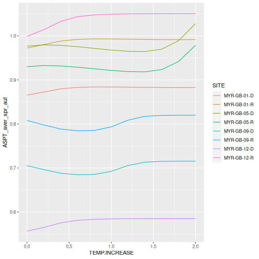

### Intro

This is a quick example to demonstrate how the `rict` package can be used to simulate the affect of temperature changes. You will see how to:

1. Update the input dataset
2. Simulate changes to a predictive variables
3. Predict and classify simulations
4. Graph and interpret results

### Setup

If you don't have R installed on your local machine, try using [Rstudio Cloud](https://rstudio.cloud/) website to run R in your web browser - it's quick and free to sign-up.

Before starting, make sure to have the required packages installed in RStudio. We are going to use `tidyverse` and `rict` packages:


```r
library(tidyverse)
library(rict)
```

**NOTE: If these packages fail to load, follow this [example](https://moderndive.netlify.app/1-3-packages.html) (replacing `ggplot2` with `tidyverse`) *and* follow this separate [guide](https://github.com/aquaMetrics/rict#install) to installing `rict`.**

### Run Predictions

Use the `rict_predict` function to calculate a set of predictions. We can make predictions based on the demo input data (`demo_observed_values`) which is available to use when the `rict` library is loaded. 


```r
predictions <- rict_predict(demo_observed_values)
```

The `predictions` output includes biological indices predictions as well as the reference temperature values used in the prediction (`MEAN.AIR.TEMP` and `AIR.TEMP.RANGE` columns). Behind the scenes, the Grid Reference is used to find the temperature values from a large file of 1km grid-square temperature values for Great Britain stored in the `rict` package. 

**NOTE: The Northern Ireland model doesn't use temperature as a predictive variable.**

### Reference Temperature

Temperature values (mean temp and temp range) are one of a number of variables (slope, altitude etc) used to predict the biological indices. It's useful to be able to look-up reference temperature values, however, we only want the 'reference' temperature values as a starting point from which we can slowly increment the temperature values to simulate temperature increase. 
  
To do this, we can include the temperature values as optional columns in our demo input dataset. Usually, we don't provide these columns as we want `rict` to look-up these values, but if we do provide these columns, `rict` will base the indices predictions on the temperature values we provide.

Here we add the `MEAN.AIR.TEMP` and `AIR.TEMP.RANGE` reference values from our predictions output into our demo input dataset:


```r
demo_observed_values <- cbind(rict::demo_observed_values,
  "MEAN.AIR.TEMP" = predictions$MEAN.AIR.TEMP,
  "AIR.TEMP.RANGE" = predictions$AIR.TEMP.RANGE
)
```

### Temperature Increments

We can now use the reference temperature values as a baseline and slowly increase the temperature.

To do this, we create a list for increasing temperatures simulating a 0-2 degree rise in temperature with 0.2 increments. 

```r
temperature_increments <- seq(0, 2, 0.2)
temperature_increments
```

```
##  [1] 0.0 0.2 0.4 0.6 0.8 1.0 1.2 1.4 1.6 1.8 2.0
```
### Simulate Temperature Increase

Here’s the big function: Loop through temperature increases and run classification and predictions for each temperature increment.


```r
modelled_temperatures <- map_df(temperature_increments, function(increment) {
  demo_observed_values$MEAN.AIR.TEMP <- demo_observed_values$MEAN.AIR.TEMP + increment
  demo_observed_values$AIR.TEMP.RANGE <- demo_observed_values$AIR.TEMP.RANGE + increment
  predict_modelled <- rict_predict(demo_observed_values)
  classify_modelled <- rict_classify(predict_modelled, year_type = "single")
  modelled <- inner_join(predict_modelled, classify_modelled, by = c("SITE", "YEAR", "WATERBODY"))
  # Add temperature increase column so we know which results match which temperature increment
  modelled$TEMP.INCREASE <- increment
  modelled$SITE <- as.character(modelled$SITE)
  return(modelled)
})

# Filter on one year - to make results easier to display
modelled_data <- modelled_temperatures %>%
  filter(YEAR == 2016)
```

The `map_df` function from the `tidyverse` package, iterates over the `temperature_increments` values and runs a function to return results for each `increment`. For each loop/iteration the function will:
  
* Updates the temperature values by adding the `increment`
* Run the `rict_predict` and `rict_classify` functions
* Join the prediction and classification outputs together using `inner_join`
* Returns the `modelled` results in a dataframe
  
For a deep-dive into iteration/loops and `map_df` type functions, see this [guide](https://r4ds.had.co.nz/iteration.html). 

### Results

Now we have the classification and predictions in a single dataframe, we can review the results of our temperature simulation. We can plot the average ASPT Spring and Autumn classification EQRs (`ASPT_aver_spr_aut`) by each temperature increase. Note, the higher the EQR value the 'better' the ecological status of the site. 


```r
ggplot(modelled_data, aes(x = TEMP.INCREASE, y = ASPT_aver_spr_aut, color = SITE)) +
  geom_line()
```



We can see the EQRs have a mixed response to increasing temperature. Note, you can find more about `ggplot` functions and creating plots with data in this [guide](https://ggplot2.tidyverse.org/). 

### Confidence in Simulation

Can we really expect increasing temperature to affect EQRs in this way? Are these simulated temperature increases beyond the scope of the model and training data used to build the model? One way to provide a partial answer this question, is to use the suitability code (`suitcode`) provided in the predictions outputs. The suitability code indicates if the input data is significantly different from the data used to train the model (and therefore we are less confident it can make accurate predictions). It assesses this on a scale between 1-5, 1 - Low difference, 5 - High difference. 

Here we select the suitability code and temperature increment to see how the confidence in the input data suitability changes as temperature increases:


```r
select(modelled_data, SITE, TEMP.INCREASE, SuitCode) %>%
  arrange(TEMP.INCREASE) %>%
  head(32) # return the first 32 rows only
```

```
##           SITE TEMP.INCREASE SuitCode
## 1  MYR-GB-01-R           0.0        1
## 2  MYR-GB-05-R           0.0        1
## 3  MYR-GB-09-R           0.0        1
## 4  MYR-GB-12-R           0.0        2
## 5  MYR-GB-01-D           0.0        1
## 6  MYR-GB-05-D           0.0        1
## 7  MYR-GB-09-D           0.0        1
## 8  MYR-GB-12-D           0.0        2
## 9  MYR-GB-01-R           0.2        1
## 10 MYR-GB-05-R           0.2        1
## 11 MYR-GB-09-R           0.2        1
## 12 MYR-GB-12-R           0.2        4
## 13 MYR-GB-01-D           0.2        1
## 14 MYR-GB-05-D           0.2        1
## 15 MYR-GB-09-D           0.2        1
## 16 MYR-GB-12-D           0.2        4
## 17 MYR-GB-01-R           0.4        3
## 18 MYR-GB-05-R           0.4        3
## 19 MYR-GB-09-R           0.4        2
## 20 MYR-GB-12-R           0.4        5
## 21 MYR-GB-01-D           0.4        3
## 22 MYR-GB-05-D           0.4        3
## 23 MYR-GB-09-D           0.4        2
## 24 MYR-GB-12-D           0.4        5
## 25 MYR-GB-01-R           0.6        5
## 26 MYR-GB-05-R           0.6        5
## 27 MYR-GB-09-R           0.6        5
## 28 MYR-GB-12-R           0.6        5
## 29 MYR-GB-01-D           0.6        5
## 30 MYR-GB-05-D           0.6        5
## 31 MYR-GB-09-D           0.6        5
## 32 MYR-GB-12-D           0.6        5
```

We can see the suitability code indicates the input data is increasing *unsuitable* as the temperature increases beyond 0.2 degrees. It appears we may be extrapolating beyond what the training data can reasonably allow. Therefore, there is low confidence in this simulation. 

### Summary

Although this example has no conclusive results, hopefully it shows how input data can be simulated to predict different scenarios. For instance, we could run a similar analysis to investigate the impact of changes to other predictive variables such as discharge. 

 
 
 
 
 
 
 
