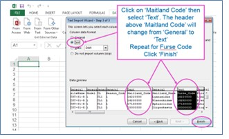

    

# Purpose 

Welcome to the RICT user guide. Here we explain how to upload macro-invertebrate
results to [RICT website](https://rictapplications.shinyapps.io/rictapp/). We then
demonstrate how to predict reference values for indices and taxa lists.
Additionally, we explain how to classify status and compare results.

# Quick Start

Before you start, you need river macro-invertebrate data to process. If you do not have any data prepared, example data is provided in the  [validation template spreadsheet](https://github.com/aquaMetrics/rict/raw/master/inst/extdat/input-file-template.xls). However, if you are looking to run your own results, you will need the following:

1. WHPT (Walley, Hawkes, Paisley and Trigg) scores based on macro-invertebrate results. To calculate WHPT index scores, you can use the [WHPT spreadsheet calculator](https://www.fba.org.uk/s/WHPT-calculator-v38.xlsx). Your scores should be based on macro-invertebrate results collected and analysed following [standard techniques](#sampling).

2. A list of predictor values based on field observations and GIS. Predictor values change depending on the geographic [area and model](#models-and-areas) you wish to use.

If you are unsure under what circumstances RICT should be used, read the [Usage](#usage) section.

## Prepare Input File

1. [Download the validation template spreadsheet](https://github.com/aquaMetrics/rict/raw/master/inst/extdat/input-file-template.xls), this provides a helpful template for your input file. For reference and testing, the template spreadsheet also includes example data.

2. Read the README instructions in the spreadsheet for guidance on completing the template.

2. Complete the template for the area required (GB - Great Britain. NI - Northern Ireland, IoM - Isle of Man) by adding in your WHPT results and predictor values.

4. Copy and paste the completed template with column names into a blank
spreadsheet and save as Comma Separated File (.CSV).

_NOTE - a template must contain data for only one region and model._

## Predict and Classify

1. Open the [RICT website](https://rictapplications.shinyapps.io/rictapp/),
select the [options](#options) you require.

2. Select 'Browse' button. Browse your files, upload the prepared .CSV
template file.

3. Depending on the [options](#options) you select, the following results will be displayed:

- Map with named site markers
  
- Download Outputs button
  
- Table of [validation](#validation) message (or a short message if all validation pass)
  
- Table of [predictions](#prediction)
  
- If [Classification](#classification) option selected, a table displaying Classification
  
- If [Predict Taxa Option](#taxa) selected, a table of predicted taxa

{ width=90% }

4. If the process fails, the website displays a red error message. 

5. See [Prediction](#prediction) and  [Classification](#classification) section for more info on these outputs.

## Compare

Compare allows you to run a comparison between two sites or the same site on different dates.

1. Prepare two .CSV input files using spreadsheet template. Use the demo [up](https://raw.githubusercontent.com/aquaMetrics/rict/master/inst/extdat/compare-data/rict-input-1-upstream-compare.csv) and [downstream](https://raw.githubusercontent.com/aquaMetrics/rict/master/inst/extdat/compare-data/rict-input-2-downstream-compare.csv) files provided as a guide or to test out.

*NOTE: RICT compares the two files row to row. For instance, row 1 in the first file is compared to row 1 in the second file. Then row 2 is compared with row 2... and so on. Therefore, the two files being compared must contain the same number of rows.*

2. Open the [RICT website](https://rictapplications.shinyapps.io/rictapp/),
navigate to the Compare tab, select the options you require, for example
'single-year' or 'multi-year'.

3. Select 'Browse' button for file 1. Browse for your saved template file and upload. Repeat for file 2.

4. RICT will display your results. An error message will appear
if all your data failed validation. See the [Compare](#compare-results) section for more information on interpreting outputs.

{ width=90% }

## Options

### Year Type

- Single-year - processes data for separately for each year at each site. Classifies each season and combined Spring and Autumn, where data is available.
- Multi-year - aggregated outputs across multiple years for each site. Provides Spring and Autumn combined classification only.

See [Classification](#classification) for more details.

### Outputs

Include [Classification](#classification) outputs and [predictions](#prediction), or only display predictions.

###	Include All Indices

This option will display predictions for all inverts indices not just WHPT predictions. RICT can predict around 60+ indices. See [All Indices](#indices) for more information. 

### Predict Taxa Lists

Display table of prediction for taxa list(s). See [taxa prediction](#taxa) for more information. 

# Background

RICT uses a model based on data collected from sampling locations with minimal
environmental pressures to predict expected conditions across the river network.
UK environment agencies use RICT to classify rivers for
Water Framework Directive (WFD) assessment, and to enforce
statutory objectives.

Key Functionality:
  
-	Predict reference indices values.
-	Predict reference taxa.
-	Classify the status of observed results compared to expected reference conditions.
-	Give a probability of status class.
-	Compare two samples and give a likelihood of whether they are significantly different.

RICT is maintained by:
  
- Environment Agency (EA)
- Natural Resources Wales (NRW)
- Northern Ireland Environment Agency (NIEA) 
- Scottish Environment Protection Agency (SEPA)

NOTE: The latest release of RICT replaces the version hosted on Azure ML Studio.

# Usage

RICT is only suitable for freshwater (not estuarine or marine) sites on rivers
or streams that are naturally permanently flowing, and flow down to the sea (not
pumped).
  
For the official status classification, you must only classify sites that have
invertebrate data from both spring and autumn of the same year. You can only
perform a WFD macro-invertebrate classification using individual spring and
autumn values of WHPT ASPT and WHPT NTaxa (based on abundance-related index
values for all families at Taxon Level 2). The official method statement for the
river invertebrate (general degradation) classification is available from [WFD UKTAG](http://www.wfduk.org/resources/rivers-invertebrates-general-degradation).
  
The probabilities of class provided by RICT are only appropriate for samples
analysed in the laboratory and expressed in the correct form of WHPT to which
the bias values relate.
  
RICT classifications cannot be used for official purposes if based on single
seasons, different forms of WHPT indices or samples not analysed in the
laboratory.

# Sampling

Collect and analyse all samples for RICT according to standard methods.
These two Environment Agency documents provide a current outline of the standard approach:

[LIT 11610 - Freshwater Macro-invertebrate Sampling in Rivers, 2017](https://www.fba.org.uk/s/LIT-11610-Freshwater-macro-invertebrate-sampling-in-rivers-09-12-2017.pdf)

[LIT 11614 - Freshwater Macro-invertebrate analysis of riverine samples, 2014](https://www.fba.org.uk/s/LIT-11614-Freshwater-macro-invertebrate-analysis-of-riverine-samples-28-Jan-2014.pdf)

More general guides are available on STAR project website: 

[http://www.eu-star.at/](http://www.eu-star.at/)

Enter > Protocols > Macro-invertebrates: RIVPACS Macro-invertebrate Sampling
Protocol (covers shallow water sampling only) and RIVPACS Sorting & Recording
(by Mike Furse).

# Validation

RICT automatically checks and validates the uploaded input file, displaying any failures or warnings.

See the [Functional Specifications](https://aquametrics.github.io/rict/articles/functional-specification.html#acceptance-and-validation-of-input-data) for the full list of checks, warnings and failure values.

# Prediction

RICT uses environmental predictors to model expected reference conditions.
Specifically, RICT uses the RIVPACS IV models (River InVertebrate Prediction and
Classification System). It is based on TWINSPAN grouping.

More information about the specification of the models can be found in the
[Functional
Specifications](https://aquametrics.github.io/rict/articles/functional-specification.html#acceptance-and-validation-of-input-data).

## Models and Areas

There are two models available:

1. Model 1 (with IoM, GB and NI variations)
- Based on a range of observed as well as physical/chemical predictors (substrate, river width, slope etc). Model 1 is the original predictive model, and this is still the definitive version, used for WFD river invertebrate status classification and objectives setting.
2. Model 44 (GB only)
- Based on GIS (geology, catchment size etc) and Alkalinity predictors using a new predictive model for GB only. This is a new model for testing and evaluation only.

RICT will automatically select the model based on the input template uploaded
and the area your grid references are located in.

## Environmental Predictors

General guidance on available data sources and use of predictor variables is outlined in sections below. More information regarding the units and exact definition of the input predictor variables for all models can be found in the [functional specification](https://aquametrics.github.io/rict/articles/user-guide.html).

### Model 1 Predictors

River substrate, width and depth predictors required for GB and NI variations of Model 1 must
be the median long-term averages that take account of conditions
throughout the whole year, including summer. Preferably they are based on annual
averages collected from many years. As a minimum, these averages should be based
on data collected in all three seasons (spring, summer and autumn) from at least
one normal year (not a year with drought or floods).
  
If you are unable to get such data, do not use actual measurements of width and
depth when you collected an invertebrate sample, particularly in summer, but use
your estimate what you think the normal width and depth should be and allow for
greater imprecision in RIVPACS predictions.
  
Environmental data from Environment Agency monitoring sites suitable for input
into RICT are available from the Ecology & Fish Data Explorer
https://environment.data.gov.uk/ecology-fish/.  This includes alkalinity and
discharge category.

### Model 44 Predictors

Input variables for Model 44 can be download from [Defra GIS website](https://environment.data.gov.uk/DefraDataDownload/?mapService=EA/RICT&mode=spatial). These can be copied and pasted into the corresponding columns on the Model 44 template.

### Alkalinity

Alkalinity (and its alternatives total hardness, calcium concentration or
conductivity) measured in Environment Agency chemical river quality monitoring
is available from Open WIMS data and
http://eawaterquality.shinyapps.io/ecologicalstatsapp/.

## Grid Reference
  
RICT uses 10-figure grid references. The 4th and 5th digits are often inaccurate
unless based on GPS. Grid references are a common cause of [data input errors](#grid-reference-errors).
  
The GB [Ordnance Survey grid
references](https://en.wikipedia.org/wiki/Ordnance_Survey_National_Grid) starts
with two letters. Where in as Northern Ireland, starts with one letter based on the
[Irish Grid Reference
System](https://en.wikipedia.org/wiki/Irish_grid_reference_system)) These
letters represent a unique 100 km square. These are followed by eastings and
northings that locate the southwest (bottom left) corner of the grid square but
describe the whole grid square, something that is often forgotten. The size of
the grid square is indicated by the number of digits in the easting and
northing. Each successive pair of easting and northing refers to a smaller grid
within the square indicated by the previous easting and northing, so the 100 m
square ST3605 is roughly in the middle of the 1 km square ST30.

## Default Outputs

The output from predictions always includes various 'bookkeeping' columns for reference:

|                                 Column Name            |     Definition                                                         |
|-----------------------------------------------------------|------------------------------------------------------------------------|
|     SITE                                                  |     Site reference number, from input file                             |
|     LATITUDE                                              |     Location point                                                     |
|     LONGITUDE                                             |     Location point                                                     |
|     LOG.ALTITUDE                                          |     Logarithmic value for Altitude                                     |
|     LOG.DISTANCE.FROM.SOURCE                              |     Logarithmic value for Distance from source                         |
|     LOG.WIDTH                                             |     Logarithmic value for Stream Width                                 |
|     LOG.DEPTH                                             |     Logarithmic value for Stream Depth                                 |
|     MEAN.SUBSTRATUM                                       |     Calculated mean substratum                                         |
|     DISCHARGE.CATEGORY                                    |     Discharge category                                                 |
|     ALKALINITY                                            |     Alkalinity                                                         |
|     LOG.ALKALINITY                                        |     Logarithmic value for Alkalinity                                   |
|     LOG.SLOPE                                             |     Logarithmic value for Slope                                        |
|     MEAN.AIR.TEMP (GB only)                               |     Calculated Mean Air Temperature                                    |
|     AIR.TEMP.RANGE (GB only)                              |     Calculated Air Temperature Range                                   |
|     p1 … p43 (GB) or p1 … p11 (NI)                        |     Probability of test site belonging to each RIVPACS IV end-group    |
|     SuitCode                                              |     Calculated Suitability code for test site                          |
|     SuitText                                              |     Text definition of suitability code for the test site              |
|     BelongsTo_endGrp                                      |     Most probable RIVPACS IV end-group the test site belongs to        |
|     Season                                                |     Season to which prediction relates                                 |

## Indices

RICT provides predicted indices outputs for a range of purposes. Primarily,
'WHPT NTAXA Abund' and 'WHPT ASPT Abund' reference condition values are
predicted and compared against observed values in the
[Classification](#classification) process. However, selecting the 'All indices'
option will predict indices for a range of other possible ecological insights.

### Indices Usage

Indices simplify complex biological results to help ecologists explain them to
managers. Although their format is intentionally very simple (usually a single
number or letter), they are actually very complex, and most do not behave as
parameters on a continuous scale. Do not use indices as a basis for statistical
analysis.
  
Users should be wary of using indices, particularly without understanding the
extent of the data from which they were derived (comprehensiveness, reliability,
geographical and stream type coverage), the statistical properties of their
format (average, score, percentage), the impact of sampling and analytical error
on the index and the magnitude of that error, the way in which the environmental
pressure that the index is designed to respond affects invertebrates, other
environmental pressures that have the same effect, cause the same environmental
pressures or interact with each other (for example, reducing the availability of
oxygen, increasing siltation, altering the availability of metal ions or
nutrients), and other environmental pressures that co-occur at sites where the
pressure of interest occurs.
  
The fact that an index sensitive to a particular pressure indicates an impact
does not necessarily mean that pressure is present at a site.
  
Invertebrates respond to the integrated effect of all environmental
pressures (both natural and anthropogenic), and it is impossible to apportion
impact to individual pressures unless an environmental pressure is so severe
that it is overwhelming. This will increasingly be the case as gross pressures
are eliminated by environmental regulation.
  
### Included Indices

You should not regard the inclusion of an index in the RICT ‘all indices' output as an endorsement of that index. Some indices have been included to
allow them to be evaluated or compared to other indices. Similarly, the
exclusion of an index does not imply that it is not useful.

| Indices Column Name | Description |
|---|---|
|           TL1_BMWP         |           Taxon Level 1    Biological Monitoring Working Party score         |
|         TL1_NTAXA       |         Taxon Level 1   Number of BMWP-scoring taxa       |
|         TL1_ASPT       |         Taxon Level 1   Average (BMWP) score per taxon       |
|         TL2_WHPT_Score_nonAb_DistFam       |         Taxon Level 2   Walley Hawkes Paisley Trigg score based on presence only (not   abundance-related) index values for distinct families       |
|         TL2_WHPT_NTAXA_nonAb_DistFam       |         Taxon Level 2   Number of Walley Hawkes Paisley Trigg scoring taxa based on distinct families       |
|         TL2_WHPT_ASPT_nonAb_DistFam       |         Taxon Level 2   Average Walley Hawkes Paisley Trigg score per taxon based on presence only   (not abundance-related) index values for distinct families       |
|         TL2_WHPT_Score_nonAb_CompFam       |         Taxon Level 2   Walley Hawkes Paisley Trigg score based on presence only (not   abundance-related) index values and BMWP composite families       |
|         TL2_WHPT_NTAXA_nonAb_CompFam       |         Taxon Level 2   Number of Walley Hawkes Paisley Trigg scoring taxa based and BMWP composite   families       |
|         TL2_WHPT_ASPT_nonAb_CompFam       |         Taxon Level 2   Average Walley Hawkes Paisley Trigg score per taxon based on presence only   (not abundance-related) index values and BMWP composite families       |
|         TL2_WHPT_Score_AbW_DistFam       |         Taxon Level 2   Walley Hawkes Paisley Trigg score based on abundance-related index values for   distinct families       |
|         TL2_WHPT_NTAXA_AbW_DistFam       |         Taxon Level 2   Number of Walley Hawkes Paisley Trigg scoring taxa based distinct families   (this is the form of WHPT NTaxa used for status classification)       |
|         TL2_WHPT_ASPT_AbW_DistFam       |         Taxon Level 2   Average Walley Hawkes Paisley Trigg score per taxon based on   abundance-related index values for distinct families (this is the form of   WHPT NTaxa used for status classification)       |
|         TL2_WHPT_Score_AbW_CompFam       |         Taxon Level 2   Walley Hawkes Paisley Trigg score based on abundance-related index values and   BMWP composite families       |
|         TL2_WHPT_NTAXA_AbW_CompFam       |         Taxon Level 2   Number of Walley Hawkes Paisley Trigg scoring taxa based on BMWP composite   families       |
|         TL2_WHPT_ASPT_AbW_CompFam       |         Taxon Level 2   Average Walley Hawkes Paisley Trigg score per taxon based on   abundance-related index values and BMWP composite families       |
|         TL1_AWIC_Fam       |         Taxon Level 1   Acid Water Indicator Community (family level), Davy-Bowker et al. (2005)   The development and testing of a macroinvertebrate biotic index for detecting   the impact of acidity on streams. Archiv für Hydrobiologie 163: 383-403       |
|         TL4_AWIC_Sp_Murphy       |         Taxon Level 4   Acid Water Indicator Community (species level). Murphy, et al. (2013) A   diagnostic biotic index for assessing acidity in sensitive streams in   Britain. Ecological Indicators 24: 562–572.       |
|         TL5_AWIC_Sp_Murphy       |         Taxon Level 5   Acid Water Indicator Community (species level). Murphy, et al. (2013) A   diagnostic biotic index for assessing acidity in sensitive streams in   Britain. Ecological Indicators 24: 562–572.       |
|         TL4_WFD_AWIC_Sp_McFarland       |         Taxon Level 4   Acid Water Indicator Community (species level). McFarland, B (2010)   Developing typology and class boundaries for WFD-AWICsp to assess   acidification in UK rivers using macroinvertebrates. WFD UK Technical   Advisory Group       |
|         TL5_WFD_AWIC_Sp_McFarland       |         Taxon Level 5   Acid Water Indicator Community (species level). McFarland, B (2010)   Developing typology and class boundaries for WFD-AWICsp to assess   acidification in UK rivers using macroinvertebrates. WFD UK Technical   Advisory Group       |
|         TL4_Raddum       |         Taxon Level 4   Raddum index. Fjellheim A. & Raddum G.G. (1990) Acid precipitation:   Biological monitoring of streams and lakes. Science of the Total Environment   96: 57-66       |
|         TL5_Raddum       |         Taxon Level 4   Raddum index. Fjellheim A. & Raddum G.G. (1990) Acid precipitation:   Biological monitoring of streams and lakes. Science of the Total Environment   96: 57-66       |
|         TL4_SEPA_per_Acid_Sensitive_Taxa       |         Taxon Level 4   Scottish Environment Protection Agency percentage Acid Sensitive Taxa. David   Rendall, Scottish Environment Protection Agency, 20th January 2010       |
|         TL5_SEPA_perc_Acid_Sensitive_Taxa       |         Taxon Level 5   Scottish Environment Protection Agency percentage Acid Sensitive Taxa. David   Rendall, Scottish Environment Protection Agency, 20th January 2010       |
|         TL4_MetTol       |         Taxon Level 4   Metal Tolerance index. Jones, IJ, et al. (2019) The Ecological Impacts   of Contaminated Sediment from Abandoned Metal Mines. Final report of WT0970   Characterisation and targeting of measures for (non-coal) polluted mine   waters – Impacts of contaminated sediment on ecological recovery September 2016.   London, Defra.       |
|         TL5_MetTol       |         Taxon Level 5   Metal Tolerance index. Jones, IJ, et al. (2019) The Ecological Impacts   of Contaminated Sediment from Abandoned Metal Mines. Final report of WT0970   Characterisation and targeting of measures for (non-coal) polluted mine   waters – Impacts of contaminated sediment on ecological recovery September   2016. London, Defra.       |
|         TL1_2_LIFE_Fam_CompFam       |         Taxon Level 1,   supplemented by Taxon Level 2 families, Lotic-invertebrate Index for Flow   Evaluation (family level) but with BMWP composite taxa as composites. Extence   et al., (1999). River flow indexing using British benthic macroinvertebrates:   a framework for setting hydroecological objectives. Regulated Rivers:   Research & Management 15: 543-574.       |
|         TL2_LIFE_Fam_DistFam       |         Taxon Level 2,   Lotic-invertebrate Index for Flow Evaluation (family level) Distinct Families   Extence et al., (1999). River flow indexing using British benthic   macroinvertebrates: a framework for setting hydroecological objectives.   Regulated Rivers: Research & Management 15: 543-574.       |
|         TL3_LIFE_Fam_DistFam       |         Taxon Level 3,   Lotic-invertebrate Index for Flow Evaluation (family level) Distinct Families   Extence et al., (1999). River flow indexing using British benthic   macroinvertebrates: a framework for setting hydroecological objectives.   Regulated Rivers: Research & Management 15: 543-574.       |
|         TL4_LIFE_Sp       |         Taxon Level 4,   Lotic-invertebrate Index for Flow Evaluation (species level) Extence et al.,   (1999). River flow indexing using British benthic macroinvertebrates: a   framework for setting hydroecological objectives. Regulated Rivers: Research   & Management 15: 543-574.       |
|         TL5_LIFE_Sp       |         Taxon Level 5,   Lotic-invertebrate Index for Flow Evaluation (species level) Extence et al.,   (1999). River flow indexing using British benthic macroinvertebrates: a   framework for setting hydroecological objectives. Regulated Rivers: Research   & Management 15: 543-574.       |
|         TL3_PSI_Fam       |         Taxon Level 3,   Proportion of Sediment-sensitive Invertebrates (family level) Extence et al.,   (2011) The Assessment of Fine Sediment Accumulation in Rivers Using   Macro-Invertebrate Community Response. River Research and Applications, 29:   17–55       |
|         TL4_PSI_Sp       |         Taxon Level 4,   Proportion of Sediment-sensitive Invertebrates (species level) Extence et   al., (2011) The Assessment of Fine Sediment Accumulation in Rivers Using   Macro-Invertebrate Community Response. River Research and Applications, 29:   17–55       |
|         TL5_PSI_Sp       |         Taxon Level 5,   Proportion of Sediment-sensitive Invertebrates (species level) Extence et   al., (2011) The Assessment of Fine Sediment Accumulation in Rivers Using   Macro-Invertebrate Community Response. River Research and Applications, 29:   17–55       |
|         TL3_E_PSI_fam69       |         Taxon Level 3,   Empirically-weighted Proportion of Sediment-sensitive Invertebrates (family   level) Turley et al., (2016). A sediment-specific family-level biomonitoring   tool to identify the impacts of fine sediment in temperate rivers and   streams. Ecological Indicators 70: 151–165       |
|         TL4_E_PSI_mixed_level       |         Taxon Level 4,   Empirically-weighted Proportion of Sediment-sensitive Invertebrates (mixed   taxon level)       |
|         TL5_E_PSI_mixed_level       |         Taxon Level 5,   Empirically-weighted Proportion of Sediment-sensitive Invertebrates (mixed   taxon level)       |
|         TL4_oFSIsp       |         Taxon Level 4,   organic Fine Sediment Index (species) Murphy et al., (2015) Development of a   biotic index using stream macroinvertebrates to assess stress from deposited   fine sediment. Freshwater Biology 60: 2019-2036       |
|         TL5_oFSIsp       |         Taxon Level 5,   organic Fine Sediment Index (species) Murphy et al., (2015) Development of a   biotic index using stream macroinvertebrates to assess stress from deposited   fine sediment. Freshwater Biology 60: 2019-2036       |
|         TL4_ToFSIsp       |         Taxon Level 4,   Total Fine Sediment Index (species) Murphy et al., (2015) Development of a   biotic index using stream macroinvertebrates to assess stress from deposited   fine sediment. Freshwater Biology 60: 2019-2036       |
|         TL5_ToFSIsp       |         Taxon Level 5,   Total Fine Sediment Index (species) Murphy et al., (2015) Development of a   biotic index using stream macroinvertebrates to assess stress from deposited   fine sediment. Freshwater Biology 60: 2019-2036       |
|         TL4_CoFSIsp       |         Taxon Level 4,   Combined Fine Sediment Index (species) Murphy et al., (2015) Development of a   biotic index using stream macroinvertebrates to assess stress from deposited   fine sediment. Freshwater Biology 60: 2019-2036       |
|         TL5_CoFSIsp       |         Taxon Level 5,   Combined Fine Sediment Index (species) Murphy et al., (2015) Development of a   biotic index using stream macroinvertebrates to assess stress from deposited   fine sediment. Freshwater Biology 60: 2019-2036       |
|         TL4_GSFI_FI05       |         Taxon Level 4,   German Stream Fauna Index (Deutscher Fauna-Index) Stream Type 05 (Siliceous   mountain streams rich in coarse material)       |
|         TL5_GSFI_FI05       |         Taxon Level 5,   German Stream Fauna Index (Deutscher Fauna-Index) Stream Type 05 (Siliceous   mountain streams rich in coarse material)       |
|         TL4_GSFI_FI09       |         Taxon Level 4,   German Stream Fauna Index (Deutscher Fauna-Index) Stream Type 09 (Silicate   low mountain rivers, rich in fine to coarse material)       |
|         TL5_GSFI_FI09       |         Taxon Level 5,   German Stream Fauna Index (Deutscher Fauna-Index) Stream Type 09 (Silicate   low mountain rivers, rich in fine to coarse material)       |
|         TL4_GSFI_FI091       |         Taxon Level 4,   German Stream Fauna Index (Deutscher Fauna-Index) Stream Type 09.1   (Carbonatic low mountain rivers, rich in fine to coarse material)       |
|         TL5_GSFI_FI091       |         Taxon Level 5,   German Stream Fauna Index (Deutscher Fauna-Index) Stream Type 09.1   (Carbonatic low mountain rivers, rich in fine to coarse material)       |
|         TL4_GSFI_FI091_K       |         Taxon Level 4,   German Stream Fauna Index (Deutscher Fauna-Index) Stream Type 09.1_K   (Carbonatic low mountain rivers, rich in fine to coarse material (Keuper))       |
|         TL5_GSFI_FI091_K       |         Taxon Level 5,   German Stream Fauna Index (Deutscher Fauna-Index) Stream Type 09.1_K   (Carbonatic low mountain rivers, rich in fine to coarse material (Keuper))       |
|         TL4_GSFI_FI092       |         Taxon Level 4,   German Stream Fauna Index (Deutscher Fauna-Index) Stream Type 09.2 (Large   rivers of the low mountain range)       |
|         TL5_GSFI_FI092       |         Taxon Level 5,   German Stream Fauna Index (Deutscher Fauna-Index) Stream Type 09.2 (Large   rivers of the low mountain range)       |
|         TL4_GSFI_FI11_12       |         Taxon Level 4,   German Stream Fauna Index (Deutscher Fauna-Index) Stream Types 11   (Organically characterised streams) and Type 12 (Organically characterised   rivers)       |
|         TL5_GSFI_FI11_12       |         Taxon Level 5,   German Stream Fauna Index (Deutscher Fauna-Index) Stream Types 11 (Organic   streams) and Type 12 (Organic rivers)       |
|         TL4_GSFI_FI14_16       |         Taxon Level 4,   German Stream Fauna Index (Deutscher Fauna-Index) Stream Types 14 (Sandy   lowland streams) + Stream Type 16 (Gravelly lowland streams) + Stream Type 18   (Loose loamy lowland streams)       |
|         TL5_GSFI_FI14_16       |         Taxon Level 5,   German Stream Fauna Index (Deutscher Fauna-Index) Stream Types 14 (Sandy   lowland streams) + Stream Type 16 (Gravelly lowland streams) + Stream Type 18   (Loose loamy lowland streams)       |
|         TL4_GSFI_FI15_17       |         Taxon Level 4,   German Stream Fauna Index (Deutscher Fauna-Index) Stream Types 15 (Sand and   clay lowland rivers) + Type 17 (Gravelly lowland rivers)       |
|         TL5_GSFI_FI15_17       |         Taxon Level 5,   German Stream Fauna Index (Deutscher Fauna-Index) Stream Types 15 (Sand and   clay lowland rivers) + Type 17 (Gravelly lowland rivers)       |
|         TL4_GSFI_FI152       |         Taxon Level 4,   German Stream Fauna Index (Deutscher Fauna-Index) Stream Types 15.2_Große   (Large lowland rivers of sand and clay)       |
|         TL5_GSFI_FI152       |         Taxon Level 5,   German Stream Fauna Index (Deutscher Fauna-Index) Stream Types 15.2_Große   (Large lowland rivers of sand and clay)       |
|         TL2_SPEAR_Fam_perc       |         Taxon Level 2,   Species at Risk from pesticides (family level) as a percentage, Beketov et   al., (2008) Freshwater biological indicators of pesticide contamination – an   adaptation of the SPEAR approach for the UK. Science Report – SC030189/SR4.   Bristol, Environment Agency.       |
|         TL4_SPEAR_Sp_perc       |         Taxon Level 4,   Species at Risk from pesticides (species level) as a percentage, Beketov et   al., (2008) Freshwater biological indicators of pesticide contamination – an   adaptation of the SPEAR approach for the UK. Science Report – SC030189/SR4.   Bristol, Environment Agency.       |
|         TL5_SPEAR_Sp_perc       |         Taxon Level 5,   Species at Risk from pesticides (species level) as a percentage, Beketov et   al., (2008) Freshwater biological indicators of pesticide contamination – an   adaptation of the SPEAR approach for the UK. Science Report – SC030189/SR4.   Bristol, Environment Agency.       |
|         SPEAR_pesticides_TL2_fam_Knillmann_2018       |         Taxon Level 2,   Species at Risk from pesticides (family level), Knillmann et al., (2018)   Indication of pesticide effects and recolonization in streams. Science of the   Total Environment 630: 1619-1627       |
|         SPEAR_refuge_TL2_fam_Knillmann_2018       |         Taxon Level 2,   Species at Risk refuge areas (family level), Knillmann et al., (2018)   Indication of pesticide effects and recolonization in streams. Science of the   Total Environment 630: 1619-1627       |
|         SPEAR_pesticides_TL4_sp_Knillmann_2018       |         Taxon Level 4,   Species at Risk from pesticides (family level), Knillmann et al., (2018)   Indication of pesticide effects and recolonization in streams. Science of the   Total Environment 630: 1619-1627       |
|         SPEAR_refuge_TL4_sp_Knillmann_2018       |         Taxon Level 4,   Species at Risk refuge areas (species level), Knillmann et al., (2018)   Indication of pesticide effects and recolonization in streams. Science of the   Total Environment 630: 1619-1627       |
|         SPEAR_pesticides_TL5_sp_Knillmann_2018       |         Taxon Level 5,   Species at Risk from pesticides (species level), Knillmann et al., (2018)   Indication of pesticide effects and recolonization in streams. Science of the   Total Environment 630: 1619-1627       |
|         SPEAR_refuge_TL5_sp_Knillmann_2018       |         Taxon Level 5,   Species at Risk refuge areas (species level), Knillmann et al., (2018)   Indication of pesticide effects and recolonization in streams. Science of the   Total Environment 630: 1619-1627       |
|         TL4_CCI       |         Taxon Level 4,   Community Conservation Index, Chadd & Extence (2004). The conservation of   freshwater macroinvertebrate populations: a community-based classification   scheme. Aquat. Conserv. Mar. Freshwater Ecosyst. 14: 597–624       |
|         TL5_CCI       |         Taxon Level 5,   Community Conservation Index, Chadd & Extence (2004). The conservation of   freshwater macroinvertebrate populations: a community-based classification   scheme. Aquat. Conserv. Mar. Freshwater Ecosyst. 14: 597–624       |
|         TL2_08_Group_ARMI_NTaxa       |         Taxon Level 2,   Number of taxa belonging to the Anglers’ Riverfly Monitoring Initiative   Index, Brooks et al., (2019) Anglers’ Riverfly Monitoring Initiative (ARMI):   a UK-wide citizen science project for water quality assessment. Freshwater   Science 38 (2): 270-280       |
|         TL2_08_Group_ARMI_Score       |         Taxon Level 2,   Anglers’ Riverfly Monitoring Initiative Index score, Brooks et al., (2019)   Anglers’ Riverfly Monitoring Initiative (ARMI): a UK-wide citizen science   project for water quality assessment. Freshwater Science 38 (2): 270-280       |
|         TL2_33_Group_ARMI_NTaxa       |         Taxon Level 2,   Number of taxa belonging to the Extended Anglers’ Riverfly Monitoring   Initiative Index       |
|         TL2_33_Group_ARMI_Score       |         Taxon Level 2,   Extended Anglers’ Riverfly Monitoring Initiative Index score       |
|         TL2_33_Group_Flow_Silt_NTaxa       |         Taxon Level 2,   Number of taxa belonging to the Extended Anglers’ Riverfly Monitoring   Initiative Silt Index       |
|         TL2_33_Group_Flow_Silt_Score       |         Taxon Level 2,   Extended Anglers’ Riverfly Monitoring Initiative Silt Index score       |
|         TL2_14_Group_Urban_NTaxa       |         Taxon Level 2,   Number of taxa belonging to the Urban Riverfly index       |
|         TL2_14_Group_Urban_Score       |         Taxon Level 2,   Urban Riverfly index score       |

## Taxa 

Predict the families and species expected at a site and their abundances. This
powerful feature of the RIVPACS model enables the prediction of a wide range of
outputs, helping with investigations and furthering our ecological
understanding.
  
Predict five taxa lists (TL) at various levels of taxonomic resolution: 

- TL1 - Super-Family
- TL2 - Super and Family level (used for routine WFD classification)
- TL3 - Family 
- TL4 - Mainly species level
- TL5 - Family / Species level

Find more information about the taxa lists and their taxonomies in [WFD100 report](https://www.fba.org.uk/s/WFD100-FINAL-Report.pdf).

The website restricts the number of sites to no more than 24 sites due to the
large amount of processing and output generated for each site. Taxa prediction
may take several minutes to run depending on the number of sites and taxa lists
required.

If you select 'Prediction Only' then classification is not run,
therefore you do not need to include biological data in the input file.

###	Taxon Prediction Output

The results from the taxon taxa predictions include Maitland and Furse taxonomic
codes, some of which have leading zeroes. It you open the CSV output file with
Excel in the normal way, you will lose these leading zeroes because Excel will
assume that they are numbers. To preserve the leading zeroes when you open the
results in Excel, you will need to open a blank Excel worksheet and import the
results as text.

{width=60%}
{width=60%}
{width=60%}
{width=60%}
  
In the output, each row includes prediction results for one taxon. For each
site, expect about 3500 rows of data if predicting all taxa lists. The first
block of rows will be for the first site selected and below it the results for
the second site. For each site, rows are ordered by taxonomic level, then by
season code, and then by Maitland code, so you should re-order the data if you
only want data for a particular season but want that for all taxonomic levels.

Each row includes the following columns:

1. _siteName_ - provided in the input file.
2. _Model_  - 1 for RIVPACS IV Model 1 GB, 2 RIVPACS IV Model 1 NI.
3. _TL_ - Taxonomic level. The five levels (TL1 – TL5) are:

- TL1 = taxa recognised by BMWP indices
-	TL2 = taxa recognised by WHPT indices
-	TL3 = all families included in RIVPACS
-	TL4 = all species included in RIVPACS species
-	TL5 = mixed taxon level (a practical, mainly species level of analysis but with less easily recognised species identified to higher taxonomic levels)
  
4. _Season_Code_ Code specifying season; 1 = spring; 2 = summer; 3 = autumn.
  
5. _Maitland_Code_ - a code identifying the invertebrate.  Maitland codes are hierarchical.  The first two digits indicates class, the next two family, the next two genus and the final two species.  Codes with a letter are artificial combinations of taxa.
  
6. _Maitland_Name_ - name of the taxon represented by the Maitland code.

7. _Furse_Code_ - Updated Maitland code, revised by Mike Furse, 2 January 2007, useful for organising results into taxonomic order.

8. _Furse_Name_ - name of taxon represented by Furse code.

9. _NBN_Code_ - National Biodiversity Network code, compiled 2007

10. _NBN_Name_ - name of taxon represented by NBN code.

11. _Average_Numerical_Abundance_ - predicted numerical abundance based on average of 10,000 simulations

12. _Average_Log10_Abundance_ - predicted log10 abundance category, based on the average of 10.000 simulations

13. _Prob_Occurrence_ - predicted probability of the taxon being present

14. _Prob_Log1_ = probability of the taxon being present in log10 abundance category 1 (numerical abundance 1-9)

15. _Prob_Log2_ - probability of the taxon being present in log10 abundance category 2 (numerical abundance 10-99)

16. _Prob_Log3_ - probability of the taxon being present in log10 abundance category 3 (numerical abundance 100-999)

17. _Prob_Log4_ - probability of the taxon being present in log10 abundance category 4 (numerical abundance 1000-9999)

18. _Prob_Log5_ - probability of the taxon being present in log10 abundance category 5 (numerical abundance 10000+)
  
Further information about the taxonomic framework and the taxon prediction
output is given in
Davy-Bowker, J, R. Clarke, T. Corbin, H. Vincent, J. Pretty, A. Hawczak, J. Blackburn, J. Murphy & I. Jones (2008) River Invertebrate Classification Tool.  Final Report. SNIFFER Project WFD72c.  Edinburgh, SNIFFER

# Classification

The most important columns from the Classification output are:

-	_Class_ – the WFD status.

-	_Probability of class_ – certainty of classification, taking account
of uncertainty caused by sampling and other errors.

-	ProbH, ProbG, ProbM, ProbP, ProbB – indicates other likely classes and whether your site is at the upper, mid or lower end of the class.

-	_EQR_ – Ecological Quality Ratio; The value of a biotic index expressed as a
proportion of its reference value. The reference value is what is expected at
minimally disturbed, near natural environmental quality.

A comparison of the EQRs for different indices and seasons can help you to
identify the environmental cause of poor quality.

## Single Year

This option undertakes status classifications for spring and autumn for a single
year. There is no difference in classification results if you run one years’
spring and summer data using the single year or the multi-year option.
However, there is a slight difference in the headers in the output file.

Single-year option also calculates single season classifications. Single season
classification are intended only for investigative work. They are unsuitable for
setting environmental quality objectives or testing compliance against them.

If you do not enter results for a season(s), RICT will leave the outputs for any
missing season(s) empty.

### Single-Year Outputs

|                                  |1              |
|:---------------------------------|:--------------|
|SITE                              |MYR-GB-01-R    |
|YEAR                              |2016           |
|WATERBODY                         |Waterbody name |
|H_NTAXA_spr                       |86.41          |
|G_NTAXA_spr                       |12.2           |
|M_NTAXA_spr                       |1.36           |
|P_NTAXA_spr                       |0.02           |
|B_NTAXA_spr                       |0.01           |
|mostProb_NTAXA_spr                |H              |
|NTAXA_eqr_av_spr                  |0.9400951      |
|H_NTAXA_aut                       |97.89          |
|G_NTAXA_aut                       |2.05           |
|M_NTAXA_aut                       |0.06           |
|P_NTAXA_aut                       |0              |
|B_NTAXA_aut                       |0              |
|mostProb_NTAXA_aut                |H              |
|NTAXA_eqr_av_aut                  |1.066254       |
|H_NTAXA_spr_aut                   |98.91          |
|G_NTAXA_spr_aut                   |1.08           |
|M_NTAXA_spr_aut                   |0.01           |
|P_NTAXA_spr_aut                   |0              |
|B_NTAXA_spr_aut                   |0              |
|mostProb_NTAXA_spr_aut            |H              |
|NTAXA_aver_spr_aut                |1.003175       |
|H_ASPT_spr                        |41.43          |
|G_ASPT_spr                        |54.16          |
|M_ASPT_spr                        |4.4            |
|P_ASPT_spr                        |0.01           |
|B_ASPT_spr                        |0              |
|mostProb_ASPT_spr                 |G              |
|ASPT_eqr_av_spr                   |0.9576179      |
|H_ASPT_aut                        |60.43          |
|G_ASPT_aut                        |37.95          |
|M_ASPT_aut                        |1.62           |
|P_ASPT_aut                        |0              |
|B_ASPT_aut                        |0              |
|mostProb_ASPT_aut                 |H              |
|ASPT_eqr_av_aut                   |0.9868443      |
|H_ASPT_spr_aut                    |52.19          |
|G_ASPT_spr_aut                    |47.53          |
|M_ASPT_spr_aut                    |0.28           |
|P_ASPT_spr_aut                    |0              |
|B_ASPT_spr_aut                    |0              |
|mostProb_ASPT_spr_aut             |H              |
|ASPT_aver_spr_aut                 |0.9722311      |
|mintawhpt_spr_H                   |35.56          |
|mintawhpt_spr_G                   |58.7           |
|mintawhpt_spr_M                   |5.7            |
|mintawhpt_spr_P                   |0.03           |
|mintawhpt_spr_B                   |0.01           |
|mintawhpt_spr_mostProb            |G              |
|mintawhpt_aut_H                   |59.15          |
|mintawhpt_aut_G                   |39.18          |
|mintawhpt_aut_M                   |1.67           |
|mintawhpt_aut_P                   |0              |
|mintawhpt_aut_B                   |0              |
|mintawhpt_aut_mostProb            |H              |
|mintawhpt_spr_aut_H               |51.66          |
|mintawhpt_spr_aut_G               |48.05          |
|mintawhpt_spr_aut_M               |0.29           |
|mintawhpt_spr_aut_P               |0              |
|mintawhpt_spr_aut_B               |0              |
|mintawhpt_spr_aut_mostProb_MINTA_ |H              |
|eqr_av_sum_aspt                   |1.045473       |
|H_ASPT_sum                        |88.94          |
|G_ASPT_sum                        |11.01          |
|M_ASPT_sum                        |0.05           |
|P_ASPT_sum                        |0              |
|B_ASPT_sum                        |0              |
|mostProb_ASPT_sum                 |H              |
|NTAXA_eqr_av_sum                  |1.141262       |
|H_NTAXA_sum                       |99.39          |
|G_NTAXA_sum                       |0.59           |
|M_NTAXA_sum                       |0.02           |
|P_NTAXA_sum                       |0              |
|B_NTAXA_sum                       |0              |
|mostProb_NTAXA_sum                |H              |
|mintawhpt_sum_H                   |88.37          |
|mintawhpt_sum_G                   |11.56          |
|mintawhpt_sum_M                   |0.07           |
|mintawhpt_sum_P                   |0              |
|mintawhpt_sum_B                   |0              |
|mintawhpt_sum_mostProb            |H              |

## Multi-year

The multi-year option combines data from spring and autumn from one or more
years into a single classification for the site. There is no limit to the number
of years’ data that can be combined. Therefore, the multi-year option only
gives output for the combined years, not for each individual year.
  
There is a slight difference in the headers in the multi-year classification
output file compared to single year, as shown in the Section Description of RICT
classification output. There is no difference in classification results if you
run one years’ spring and summer data using the single year or the multi-year
experiment.
  
There are slight differences in the way that RICT estimates the probabilities of
class for multi-year classifications compared to previous versions of RICT.

The current RICT bases this on the proportion of all simulated multi-year
average EQR values falling in each status class, whereas RICT 1.0 used an
estimate of the “typical” (i.e., average) between-year variance within a 3-year
period for the observed values of a WHPT index to allow for 1 or 2 years missing
data. Neither is philosophically correct, as explained [Development History](#development-history) section.

### Multi-Year Outputs

|                                  |1              |
|:---------------------------------|:--------------|
|SITE                              |MYR-GB-01-R    |
|YEAR                              |2016           |
|WATERBODY                         |Waterbody name |
|H_NTAXA_spr_aut                   |98.73          |
|G_NTAXA_spr_aut                   |1.26           |
|M_NTAXA_spr_aut                   |0.01           |
|P_NTAXA_spr_aut                   |0              |
|B_NTAXA_spr_aut                   |0              |
|mostProb_NTAXA_spr_aut            |H              |
|NTAXA_aver_spr_aut                |1.002402       |
|H_ASPT_spr_aut                    |52.84          |
|G_ASPT_spr_aut                    |46.79          |
|M_ASPT_spr_aut                    |0.37           |
|P_ASPT_spr_aut                    |0              |
|B_ASPT_spr_aut                    |0              |
|mostProb_ASPT_spr_aut             |H              |
|ASPT_aver_spr_aut                 |0.9731396      |
|mintawhpt_spr_aut_H_MINTA_        |52.21          |
|mintawhpt_spr_aut_G_MINTA_        |47.41          |
|mintawhpt_spr_aut_M_MINTA_        |0.38           |
|mintawhpt_spr_aut_P_MINTA_        |0              |
|mintawhpt_spr_aut_B_MINTA_        |0              |
|mintawhpt_spr_aut_mostProb_MINTA_ |H              |

## Probabilities of class

Probabilities of class indicate the likelihood of your site belonging to each of
the WFD status classes. Every site must belong to one of the 5-classes, so for
any combination of index and season(s), the probabilities always add-up to 100%.
These estimates take account of **two types of classification error**:

1. The fact that when the EQR is at exactly the class boundary, the maximum likelihood of being in either of the classes immediately above or below that boundary is only 50%.

2. Uncertainty caused by sampling error (measured in a number of studies in which the same site was sampled by different people at the same time) and laboratory error (from the bias value that you enter with your biological data).

The probabilities are based on the frequency if each class being indicated by
the 10,000 Monte Carlo simulations. Each simulation includes a random component
with the same distribution as the known bias and sampling error. Remember that
other sources of error mentioned in this section, which cannot be qualified,
will also contribute to the imprecision of the classification.

## MINTA (Minimum of NTaxa and ASPT)

The official Water Framework Directive (WFD) status classification is based on
data (Environmental Quality Ratios) for both WHPT ASPT and WHPT NTaxa from both
spring and autumn. Data from both seasons is combined by taking an average of
the EQRs before determining the status classification. The status classification
from both indices is combined by taking the worst class indicated by the two
indices. MINTA is not determined from the most probable classes for each index,
but by the combination of the probabilities of class for each index.
  
Understanding how the probabilities of class are determined for MINTA is often
misunderstood, particularly as the outcome is sometimes counter-intuitive and
has caused users, including the author, to assume that there has been a mistake.
MINTA probabilities of class are not calculated from the distribution of
probabilities of the individual indices.
  
They are calculated separately, in exactly the same way as the probabilities of
class for the individual indices, by going back to the results of each of the
10,000 Monte Carlo simulations. The MINTA probabilities are based on the worst
class indicated by either ASPT or NTaxa in each of the 10,000 Monte Carlo
simulations.
  
The number of simulations in which the worst of these classes was High, Good,
Moderate, Poor or Bad are summed and expressed as percentages of the 10,000
simulations.  This is the same process used to determine the probabilities of
class for the individual indices, but this time, for each simulation RICT only
considers the class indicated by the index that indicated the worst class.

## Interpreting Classification Output 

Classification is based on both your observed data and RIVPACS prediction, so
you must consider imprecision in both of these when interpreting classification
results. You must take account of the reliability of the predictions, see
Section Interpreting RICT2 prediction output.
   
Always check the suitability code from the prediction results, which is based on
the combination of environmental input variables and how closely they match any
of the RIVPACS end groups. Suitability is quite different to the probability of
class, which does not take suitability into account.
  
You should also consider any environmental parameters that exceed warning limit
values when judging the reliability of the predictions and therefore of the
classification. Another factor is the quality of the input data: whether the
environmental data is based on true long-term averages or an estimate base on
biologist’s expert opinion.
  
For classification, the quality of the observed biological data is also
important. This is partly reflected in the bias value, which represents a
component of sorting and data handling error. You should also consider whether
the biologist collecting the samples collected them correctly, or experienced
anything that made sampling difficult, such as high or low flow, poor access to
the site, damaged nets, declining light or turbid water, which should be
recorded with the sample data. Always consider the probabilities of class and do
not base management decisions solely on the face value or most probable class.
  
A site with an objective quality of Good that is classed as Moderate is less
likely to have failed that standard if it also has a reasonably high probability
of being good or better, and may not have actually failed the standard, whereas
a site classed as Moderate but with high probabilities of being Poor or Bad is
more likely to have failed the standard and the need for management action is
much more certain. Remember that probabilities do not always behave intuitively,
as shown in the explanation of MINTA in the preceding Section.
  
Two examples below illustrate how the result can be counter-intuitive:
  
Site A The most probable class of both ASPT and NTaxa are the same, Good, but
MINTA indicated Moderate. Many of the simulations in which the worst class was
indicated as Moderate by ASPT were different to the simulations where this was
the worst class indicated as Moderate by NTaxa. As a result, when the number of
simulations in which Moderate was indicated by ASPT and by NTaxa were added
together, it came to a greater number than for each individual index, hence
Moderate was the most probable MINTA class even though the most probable class
for both indices individually was Good. It’s not uncommon for the MINTA most
probable class to be worse that the most probable classes indicated by either
ASPT or NTaxa separately.
  
Site B The most probable class indicated by ASPT and NTaxa were different, but
MINTA indicated an even worse class. A similar thing happened here as at Site A,
but more extreme. Some of the simulations in which Bad was indicated by ASPT
were different to the simulations in which Bad was indicated by NTaxa, so when
combined, more simulations were Bad according to MINTA than any other class. At
Site A, the probability of the MINTA class being Good and Moderate are similar,
and at Site B there is little difference in the probabilities of the MINTA class
being poor or bad.  This indicates the importance of using the probabilities of
class to make decisions rather than simply the face value class or even the most
probable class.

# Compare Results

Compare allows you to run a comparison between two sites or the same site on 
different dates. The outputs consist of ASPT & NTAXA EQRs and their difference
statistics. Probabilities of sites being different, and probabilities of each
site class combination are also given.

# Development History

## Before RICT

Before RICT was available, RIVPACS III+, a FORTRAN programme, was ran locally,
implemented the RIVPACS III predictive models.

## Rewrite in R

The first version of RICT was a web application hosted by SEPA. This version was
written in Oracle Express. RICT version 2 (RICT2) was re-written in R and hosted
on Azure ML Studio. Re-writing in R made it more accessible to researchers and
other ecologists to modify and customise. This also makes the software easier
and cheaper to maintain. RICT version 3 hosted the R code in Github and
provide a single web app replacing what was available on Azure ML Studio .

## Changes Made

RICT2 corrected several errors in the original RICT, particularly the
prediction and classification programmes.  Because of this, results from RICT2 differ from those produced by RICT. The following errors were
discovered in RICT and corrected in RICT2:

•	RICT inadvertently used the ‘composite families’ version of WHPT ASPT (i.e. TL2 WHPT Score AbW, CompFam) rather than the ‘distinct families’ version (TL2 WHPT Score AbW, DistFam), although it did take account of the additional families included in WHPT.  The composite families are those that were grouped together in the BMWP-score in compliance with the current taxonomy of the time, outlined in Maitland (1977), see Appendix A

•	RICT did not adjust for sample bias correctly in the calculation of simulated EQI/EQR values for WHPT ASPT

•	RICT suffered from other errors that caused estimates of probability of class based on WHPT ASPT adjusted for sample bias to differ from independent estimates even when the error in sample bias correction was taken into account.

The errors above were reported in Clarke, R.T. & J. Davy-Bowker (2018) Testing
old (2008-18) RICT predictions and classification uncertainty using independent
RIVPACS code and new RIVPACS test data: Components 1-3. A Report to the
Environment Agency. Wareham, Freshwater Biological Association: pp 84 +
preliminaries

•	In addition, RICT used an old table of Biologists’ Assessment Values indicating which of the RIVPACS reference sites complied with WFD intercalibration screening criteria that caused a slight error in the conversion factors used to determine EQRs.

Results from RICT2 were checked against independent programmes using
the test data. This provides assurance against errors that previous versions of
RICT did not have.
  
There is a difference in the way that the probabilities of class are estimated
for multi-year classifications.
  
Multi-year site assessments in RICT2 are based on averaging the EQR for
each available year, so are just the status class of the average EQR for the
years for which data is available.  The proportion of all simulated multi-year
average EQR values falling in each status class gives us the estimated
probability of class. This is not philosophically correct because we must be
less sure about the confidence of class for the average EQR over several years,
but because we do not have any data for the missing years, we cannot estimate
it.
  
The initial version of RICT used an estimate of the “typical” (i.e. average)
between-year variance within a 3-year period for the observed values of a WHPT
index to allow for 1- or 2-years missing data. This was also not satisfactory
because a site could differ by any amount within a 3-year period depending on
the extent of natural variation, extreme years and/or anthropogenic related
stress. There are three advantages to the new approach to multi-year
classification used in RICT2:
  
1.	If you do a multi-year site classification based on just one year, you will get the same probabilities of class as if you had done a single year classification for the same single year’s data.

2.	The number of years that can be combined is not limited, whereas in the original RICT, the maximum was limited to three over a 3-year period.

3.	The same approach can be used to determine classifications based on data from multiple sites.

RICT version 3 keeps these changes.

# Contributing

The RICT code is available as open-source R package available on github. If you
wish to customise the workflow or run large datasets, it may be useful to run
the code on your local machine. You can download the [package from
Github](https://github.com/aquaMetrics/rict) for this purpose. For contributing
to the code, please see [contributing
guidelines](https://github.com/aquaMetrics/rict/blob/master/CONTRIBUTING.md).

# Troubleshooting

This section describes common issues that can cause the tool to fail.

### Re-run
Sometimes, the website can fail the first time that you run it. Before checking
anything else, always reload, to see if it runs on a second attempt. These
unexplained failures, possibly caused by a data transfer drop-out somewhere
along the line, are the common causes of app failing to run.

###	Use Correct Validation Input File
Obtain the latest input file from the RICT site. Ensure you have
downloaded the correct version of the input file.

###	Check Input File is in Correct Format
Once you have entered the data into the Excel (xls) file, the input file must be
saved in CSV (comma delimited) file format only. Other formats will not be
processed by RICT. Other formats may not be able to be uploaded or the tool may
not run.

###	Remove Empty or Null Lines Within Input File
Any empty lines at the end of the input file may cause RICT to fail. Ensure the
last line of the input file is the last site you have submitted. Blank lines, or
lines of commas may cause RICT to fail.

###	Remove Red Validation Fails from the Input File
When using the validation spreadsheet any cells with values above/below the
tolerances/ranges will show as red in the spreadsheet. These sites may fail the
whole run therefore remove these sites from the input file.

###	Site Not Appearing in the Output
If a site is included in the input file but it is not appearing in the output
file, it is likely that some of the inputted data exceeds the failure
tolerances. Check validations output to see if this is the case.

### Errors

Common error messages and cause:

Error             | Known Cause
-------------     | -------------
The data provided contains more than one area of the UK. Hint: Check your data contains NGR grid letters for either: GB or NI | Row of blank data at the end of the input file
Arguments imply differing number of rows  | Season code missing from input file Grid reference in the sea so no temperature (can be caused by 4-figure easting and/or northing)
Argument is of length zero | Temperature data missing because grid reference in the sea or too close to the shore

### Grid Reference Errors
 
Incorrect grid references are a common cause of problems, particularly if they
are in the sea. RICT uses the grid references to extract mean air temperature
and temperature range from an internal data file, but the temperature data that
RICT uses only covers the land. The temperature data does not reach as far as
the sea, so sites close to the coast can also fail. If such sites fail, you
should use a slightly more inland grid reference.
  
Leading zeroes may be omitted because the CSV input file ignores them, but
trailing zeroes must be included. Eastings and northings for fully numerical
grid references (without NGR letters) should not be used.

###	RICT Project Info

The RICT project website contains all the background documentation for RICT. The
RICT site can be accessed by visiting:
https://www.fba.org.uk/other-scientific-collaborations/rivpacs-and-rict

